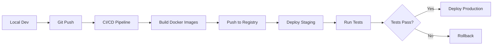

# OpenKey AI-Driven Development Architecture

## 🏗️ New Architecture Overview

The OpenKey project uses a **three-layer architecture** that cleanly separates the AI orchestration system from the generated deployable code:

```
openkey/                           # Root monorepo
├── orchestrator/                  # AI Pipeline System (reusable)
│   ├── .claude/                   # Claude subagent configs
│   ├── pipeline/                  # Mastra pipeline logic
│   ├── specs/                     # Project specifications
│   ├── state/                     # Pipeline execution state
│   └── templates/                 # Project generation templates
├── project/                       # Generated OpenKey Project (deployable)
│   ├── backend/                   # Express API
│   ├── frontend/                  # Next.js app
│   ├── shared/                    # Shared types/utils
│   ├── tests/                     # Test suites
│   ├── docker-compose.yml         # Local dev setup
│   └── package.json               # Project dependencies
└── deployments/                   # Deployment Configurations
    ├── local/                     # Local dev scripts
    ├── staging/                   # Staging deployment
    └── production/                # Production deployment
```

## 🔄 Git Workflow

### 1. **Orchestrator Repository** (AI Pipeline System)
```bash
# This is reusable across projects
git init orchestrator
cd orchestrator
git add .
git commit -m "feat: Generic AI pipeline orchestrator"
git remote add origin git@github.com:yourorg/ai-orchestrator.git
git push -u origin main
```

### 2. **Generated Project Repository** (OpenKey)
```bash
# The AI generates a deployable project
cd project
git init
git add .
git commit -m "feat: Initial OpenKey implementation by AI"
git remote add origin git@github.com:yourorg/openkey.git
git push -u origin main
```

### 3. **Deployment Configurations** (Optional separate repo)
```bash
# Can be part of project or separate for security
cd deployments
git init
git add .
git commit -m "chore: OpenKey deployment configurations"
git remote add origin git@github.com:yourorg/openkey-deployments.git
git push -u origin main
```

## 📁 Why This Structure?

### **Clean Separation of Concerns**

1. **Orchestrator** = The tool that builds software
   - Reusable for any project
   - Contains AI agents and pipeline logic
   - Evolves independently

2. **Project** = The actual software being built
   - Deployable standalone application
   - No AI dependencies
   - Standard Node.js/Docker project

3. **Deployments** = Infrastructure configurations
   - Environment-specific settings
   - CI/CD pipelines
   - Can be managed separately for security

### **Benefits**

- ✅ **Clean deployments**: Project folder contains only production code
- ✅ **Reusable orchestrator**: Build multiple projects with same AI system
- ✅ **Version control**: Each component has its own git history
- ✅ **Security**: Deployment secrets separate from code
- ✅ **Professional structure**: Generated code looks hand-written

## 🚀 Development Workflow

### Initial Development
```bash
# 1. Start the orchestrator
cd openkey
claude-code

# 2. Implement from spec
> implement orchestrator/specs/openkey.spec.yaml

# 3. AI generates project in project/ directory
# 4. Test the generated project
cd project
docker-compose up

# 5. Deploy when ready
npm run deploy:staging
```

### Iterative Improvements
```bash
# 1. Orchestrator refines pipeline
> refine

# 2. AI regenerates improved code
# 3. Review changes in project/
cd project
git diff

# 4. Commit improvements
git add -A
git commit -m "feat: AI improvements - better auth performance"
git push
```

### Manual Modifications
```bash
# You can still modify generated code manually
cd project
# Make your changes
git add -A
git commit -m "fix: Manual adjustment to login flow"
git push
```

## 🔐 Production Deployment Flow



### Deployment Commands
```bash
# Local testing
cd project
npm run deploy:local

# Staging deployment
npm run deploy:staging

# Production deployment (with confirmations)
npm run deploy:production

# Emergency rollback
cd deployments/production
./rollback-production.sh <previous-version>
```

## 📊 State Management

The orchestrator maintains state for pipeline execution:

```
orchestrator/state/openkey/
├── current-state.json      # Active pipeline state
├── checkpoints/            # Resumable checkpoints
│   ├── init-2024...json
│   ├── build-2024...json
│   └── test-2024...json
└── evaluations/            # Quality assessments
    ├── iteration-1.json
    └── iteration-2.json
```

## 🧪 Testing Strategy

### Generated Tests
The AI generates comprehensive tests in `project/tests/`:
- Unit tests for all components
- Integration tests with Playwright MCP
- E2E tests using ngrok for HTTPS
- Security audit scripts

### Test Execution
```bash
cd project

# All tests
npm test

# Specific suites
npm run test:unit
npm run test:integration
npm run test:e2e
npm run test:security
```

## 🔄 Continuous Improvement

The pipeline learns from each iteration:

1. **Build** → AI generates code
2. **Test** → Automated testing finds issues  
3. **Evaluate** → Compare against spec criteria
4. **Refine** → AI improves its approach
5. **Rebuild** → Better code generation

This creates a feedback loop where the AI gets better at building software over time.

## 🎯 Key Principles

1. **Deployable First**: Generated code must be production-ready
2. **No AI Dependencies**: Project runs without orchestrator
3. **Standard Patterns**: Follow industry best practices
4. **Clean Git History**: Meaningful commits, proper branching
5. **Security by Design**: Secrets management, least privilege
6. **Observability**: Logging, monitoring, tracing built-in

## 🚦 Getting Started

1. **Clone this repo**:
   ```bash
   git clone git@github.com:yourorg/openkey.git
   cd openkey
   ```

2. **Run the orchestrator**:
   ```bash
   claude-code
   > implement orchestrator/specs/openkey.spec.yaml
   ```

3. **Watch the AI build OpenKey**:
   - Creates project structure
   - Implements all components
   - Sets up testing
   - Configures deployment

4. **Deploy your AI-built app**:
   ```bash
   cd project
   docker-compose up
   ```

The result is a professional, production-ready application that happens to be built by AI! 🎉