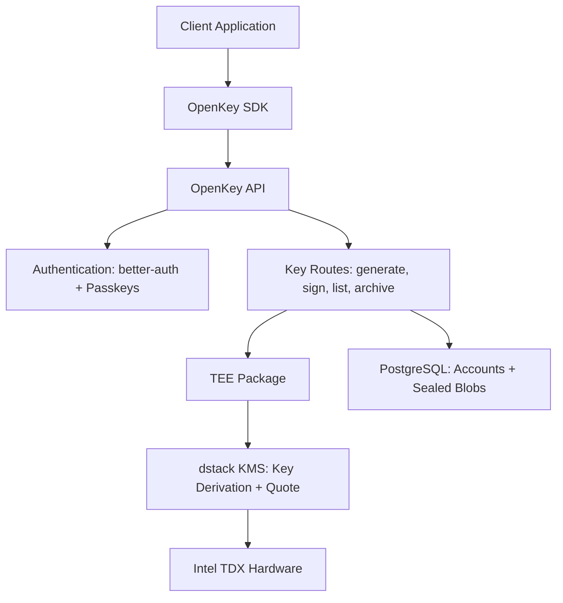

# OpenKey: Transparent Key Custody

**Version 0.1.0**

**Author:** TinyCloud Labs

---

OpenKey is a key custody system for applications that need blockchain
signatures without handling user private keys. It generates and stores
Ethereum-compatible signing keys behind passkey authentication, seals private
keys with hardware-derived keys inside a Trusted Execution Environment (TEE),
and exposes signing through OAuth and SDK flows.

The goal is not to remove every trust assumption. The goal is to make custody
auditable: users and applications can inspect the code, verify the deployed
environment through attestation, and understand exactly where trust remains.

---

## Table of Contents

1. [Introduction](#1-introduction)
2. [Implementation Status](#2-implementation-status)
3. [Transparent Custody](#3-transparent-custody)
4. [Architecture](#4-architecture)
5. [Identity, Authentication, and Integration](#5-identity-authentication-and-integration)
6. [Threat Model](#6-threat-model)
7. [Export, Self-Hosting, and Roadmap](#7-export-self-hosting-and-roadmap)
8. [Conclusion](#8-conclusion)
9. [References](#9-references)

**Appendices**

- [Appendix A: Background Technologies](appendix/appendix-a-background-technologies.md)
- [Appendix B: Sealing Algorithm](appendix/appendix-b-sealing-algorithm.md)
- [Appendix C: Attestation Verification](appendix/appendix-c-attestation-verification.md)
- [Appendix D: Key Export Protocol](appendix/appendix-d-key-export-protocol.md)
- [Appendix E: Glossary](appendix/appendix-e-glossary.md)

---

## 1. Introduction

Every blockchain application eventually touches a signing key. Users need keys
to own assets, authorize operations, and prove identity. Developers need those
keys to be usable from ordinary web and mobile applications. The hard part is
that private keys are both critical and fragile: if a user loses the key, they
lose access; if an attacker gets the key, the account is compromised.

The industry usually offers two choices.

**Traditional custody** gives users convenience by letting a service hold keys.
The user experience is familiar, but the operator becomes a high-value target
and a point of control. Users must trust the custodian not to steal funds, lose
keys, change policy, freeze accounts, or be compelled to act against them.

**Self-custody** gives users control by making them hold keys directly. This
removes the custodian but shifts operational burden onto users. Seed phrases
are lost, copied, phished, photographed, stored in cloud drives, or confused
with ordinary recovery codes. Most users do not want key management to be their
job.

OpenKey sits between these models. The service manages keys for users, but the
operator should not be able to read those keys under the stated hardware and
software assumptions. Keys are generated and unsealed only in a TEE-backed
runtime. The database stores sealed blobs, not plaintext keys. Applications ask
OpenKey to sign; OpenKey authenticates the user, unseals the key inside the
protected boundary, signs, and returns the signature.

This model is useful for TinyCloud because TinyCloud operations need signatures:
creating spaces, producing delegation credentials, and invoking capabilities.
OpenKey provides that signing layer without forcing each TinyCloud application
to manage private keys. The same model also applies to any application that
needs user-controlled EVM signatures with a simpler onboarding flow.

---

## 2. Implementation Status

This paper describes both the current implementation and protocol directions.
The distinction matters: implemented features are in the OpenKey repository
today; specified features describe intended protocols; roadmap items are future
work.

| Capability | Status |
|------------|--------|
| Passkey-first authentication | Implemented |
| Email OTP or Google registration before passkey creation | Implemented |
| Email OTP passkey recovery flow | Implemented |
| Managed Ethereum key generation | Implemented |
| AES-256-GCM sealed blobs in PostgreSQL | Implemented |
| dstack-derived per-user sealing key | Implemented |
| EIP-191 `personal_sign` and raw message signing | Implemented |
| EIP-712 typed data signing | Implemented |
| Attestation quote endpoint | Implemented |
| Key archive and unarchive | Implemented |
| External wallet linking by signed challenge | Implemented |
| OAuth 2.1 provider with PKCE | Implemented |
| SDK popup/iframe/redirect widget flows | Implemented |
| Per-key derivation paths | Specified; current implementation is per-user |
| Key export ceremony | Specified; not implemented |
| Self-hosting documentation | Planned |
| OIDC discovery and federation | Planned |
| Client-side attestation verification pipeline | Planned |
| Reproducible builds and published measurements | Planned |
| Multi-enclave separation | Roadmap |
| In-enclave policy engine | Roadmap |
| Decentralized KMS | Roadmap |
| Post-quantum migration strategy | Roadmap; pending ecosystem standards |
| On-chain attestation registry | Roadmap |

The current production security argument therefore rests on passkeys,
TEE-backed sealing, dstack key derivation, open source code, and a quote
endpoint. It does not yet include a complete public verifier workflow,
reproducible release measurements, key export, or decentralized KMS.

---

## 3. Transparent Custody

OpenKey uses the term **transparent custody** for a custody model with five
properties:

1. **Custodial delegation.** A service manages keys during normal operation.
Users do not handle raw private keys for ordinary signing.
2. **Hardware isolation.** Key material is generated, unsealed, and used inside
a TEE-backed runtime rather than in the ordinary application host.
3. **Remote attestation.** Clients can request cryptographic evidence about the
hardware and code environment serving a key.
4. **Open source implementation.** The application code, TEE wrapper, API, and
SDK are inspectable and forkable.
5. **Deliberate exit path.** The design includes a user-controlled export
ceremony, although this ceremony is specified rather than implemented today.

Transparent custody is not "zero trust." It changes what must be trusted. A
traditional custodian asks users to trust an operator's policy and intent.
OpenKey asks users to trust a smaller and more technical set of assumptions:
Intel TDX hardware, dstack/Phala KMS behavior, the deployed code measurement,
the correctness of OpenKey's code, and the user's authentication devices.

### Comparison

| Property | OpenKey | Turnkey | Privy | Para |
|----------|---------|---------|-------|------|
| Primary model | TEE custody | TEE custody | SSS/TEE hybrid | MPC-TSS |
| Operator can directly read keys? | No under TEE/KMS assumptions | No under enclave assumptions | Depends on configuration | No complete key exists |
| Key assembled? | In protected runtime for signing | In enclave for signing | In browser or enclave depending on mode | Never assembled |
| Open source surface | OpenKey stack + dstack | QuorumOS public; applications proprietary | Partial | Partial |
| Hardware trust | Intel TDX + dstack KMS | AWS Nitro | AWS Nitro for server-side wallets | None for key assembly |
| Liveness dependency | OpenKey instance needed for normal signing | Turnkey needed for normal signing | Provider dependent | Para co-signing required |
| User exit | Export protocol specified | Export supported by provider | Export supported | Provider dependent |
| Decentralization | Designed for self-hosting; KMS still centralized today | Centralized provider | Centralized provider | Centralized provider |

The important distinction is not that OpenKey has no trust assumptions. It is
that those assumptions are meant to be visible. The application can be audited.
The deployed runtime can produce attestation. The limitations are explicit.

### What OpenKey Does Not Protect Against

OpenKey does not protect against every way a user can be harmed.

- **Compromised user devices.** Malware or remote control on the user's device
can approve malicious signing requests.
- **Coerced authentication.** A passkey proves user presence or verification;
it does not prove the user is acting freely.
- **Malicious applications.** OpenKey signs the request the user approves. It
does not understand every application-level consequence of a signature.
- **TEE side channels or hardware bugs.** Private keys exist in plaintext in
protected memory during signing. TDX bugs, firmware flaws, or side-channel
attacks could break the isolation model.
- **Intel or dstack compromise.** The model assumes the hardware vendor and KMS
infrastructure do not subvert attestation or key derivation.
- **Bad deployed code.** Attestation can identify code, but users still need a
trusted measurement or verifier process to know that the code is acceptable.
- **Quantum attacks on ECDSA.** OpenKey currently manages EVM-compatible ECDSA
keys, which share the long-term quantum risk of existing blockchain accounts.

These limits are part of the security model, not footnotes. OpenKey improves
custody by narrowing and exposing trust; it does not make private keys riskless.

---

## 4. Architecture

OpenKey is a web service with four core layers:



The repository is a Bun/Turbo monorepo. The API is a Hono service, the web
frontend is SvelteKit, `packages/tee` wraps dstack and cryptographic sealing,
and `packages/sdk` provides browser integration for third-party applications.

### Operational Flow

1. A user registers with email OTP or Google sign-in.
2. The user must create a passkey. Email/password login is disabled.
3. A database hook creates the user's primary managed Ethereum key.
4. The private key is generated server-side, sealed with an AES-256-GCM key
derived through dstack, and stored as a sealed blob in PostgreSQL.
5. During signing, OpenKey authenticates the session, fetches the sealed blob,
derives the sealing key again, unseals the private key in the protected runtime,
produces an EVM-compatible signature, and returns only the signature.
6. Applications interact through OAuth 2.1, the SDK, or embedded widgets rather
than handling private key material.

### Key Sealing

OpenKey stores private keys as sealed blobs. In production, `@openkey/tee`
calls dstack to derive a key for the path:

```text
openkey/user/{userId}/keys
```

The current implementation uses this per-user path for all managed keys owned
by that user. Appendix B specifies per-key paths as a future migration path,
which would reduce the blast radius of a derived-key compromise.

Sealing uses AES-256-GCM with a random 12-byte IV. The stored value includes the
IV, authentication tag, and ciphertext. PostgreSQL therefore contains the
public address, metadata, and sealed blob; it does not contain plaintext private
keys.

### Attestation

OpenKey exposes an attestation quote endpoint for keys:

```text
GET /api/keys/{keyId}/quote
```

The endpoint returns a TDX quote, the key address, and whether the server
believes it is running in TEE mode. This is evidence, not complete verification
by itself. A robust client verification flow must validate the quote signature,
check TCB status, compare measurements against trusted release values, and bind
the quote to a fresh verifier challenge. Appendix C describes this verifier
work; the production verifier pipeline and reproducible measurement publishing
remain planned work.

### Managed and External Keys

OpenKey supports two key types.

**Managed keys** are generated by OpenKey, sealed in PostgreSQL, and used by the
API for signing after authentication. Key 0 is created automatically for new
users. Users can create additional managed keys, label them, archive them, and
unarchive them.

**External keys** represent wallets controlled outside OpenKey. Linking uses a
challenge-response flow: the external wallet signs a generated message, OpenKey
verifies the signature, and the account records the address with `sealedBlob`
set to null. External keys sign client-side through the user's wallet provider.

---

## 5. Identity, Authentication, and Integration

OpenKey manages Ethereum-compatible secp256k1 signing keys. A key's address can
be represented as a `did:pkh` identifier:

```text
did:pkh:eip155:{chainId}:{address}
```

This identity is independent of an OpenKey instance. If a user later exports a
key and imports it into another wallet or another OpenKey-compatible instance,
the address and DID remain the same.

### Passkey-First Authentication

OpenKey uses passkeys as the primary login mechanism. Passkeys are WebAuthn
credentials bound to an origin such as `openkey.so`. A credential created for
the real origin cannot be replayed on a phishing domain, and the server stores
public credential data rather than passwords.

Registration starts with email OTP or Google sign-in to establish an email
address, then requires passkey creation before the account is usable. Subsequent
login is passkey-based. Sessions are database-backed and expire after seven
days, with periodic refresh.

The current recovery flow uses email OTP to verify the user and add a new
passkey. That is useful for usability, but it also means email security matters.
An attacker who compromises a user's email may be able to begin account
recovery, so sensitive operations such as key export require additional
ceremony in the specification.

### OAuth and SDK Integration

OpenKey is also an OAuth 2.1 identity provider for applications. Clients are
pre-registered; dynamic client registration is disabled. Authorization uses
PKCE. The implemented scopes are:

- `openid`: minimal identity
- `email`: email claims
- `keys`: active key addresses and key IDs
- `offline_access`: refresh token access

The browser SDK wraps OAuth and signing flows. Applications can use popup,
iframe, or redirect modes. For managed keys, signing requests go through the
OpenKey widget and authenticated API. For linked external keys, the SDK routes
signing to the user's local wallet provider.

Supported signing formats include EIP-191 `personal_sign`, EIP-712 typed data,
and raw message signing for protocols that define their own hashing rules.
Applications should prefer structured or prefixed signing formats when
possible, because raw signatures are easier to misuse.

---

## 6. Threat Model

OpenKey's security depends on the boundary around verified hardware, verified
code, and authenticated user intent. The following risks are the most important
ones to understand.

### Phala/dstack KMS

dstack derives application keys through Phala's KMS infrastructure. OpenKey's
TEE package calls dstack, and the same path can deterministically derive the
same sealing key for an attested application.

This creates a real trust assumption. If Phala's KMS infrastructure were
compromised, coerced, or modified to log derived keys, OpenKey does not
currently have a cryptographic proof that logging did not happen. Open source
code and attestation reduce the trust surface, but they do not eliminate this
centralized KMS dependency. A decentralized KMS is therefore a roadmap item,
not a property of the current system.

### Operator and Code Integrity

The operator deploys the code that runs in the protected environment.
Attestation can report what code is running, but users and applications need a
trusted way to decide whether that measurement corresponds to acceptable source
code. Until reproducible builds and published measurements are in place, the
verification story is incomplete.

A malicious operator could also deploy malicious code and ask users to interact
with it before they check attestation. This is why attestation must become part
of the client workflow, not a rarely used debugging endpoint.

### Authentication Attacks

The TEE cannot help if an attacker authenticates as the user and asks OpenKey to
sign. Passkeys reduce phishing risk through origin binding and hardware-backed
credentials, but user devices, browsers, sessions, and email recovery are still
attack surfaces.

OpenKey should therefore treat high-risk operations differently from ordinary
signing. The specified export protocol requires explicit user action, fresh
verification, delay, notification, and local encryption to a client-generated
recipient key.

### TEE Limitations

All TEE-based key managers share an unavoidable fact: the key must exist in
plaintext somewhere during signing. In OpenKey, that place is protected memory
inside the TEE-backed runtime. Hardware bugs, side channels, faulty firmware, or
incorrect deployment configuration could expose secrets despite the intended
isolation.

Multi-enclave separation is a roadmap item meant to reduce blast radius. A
future architecture can isolate API handling, policy evaluation, signing, and
notarization so that compromise of one component does not immediately imply key
extraction or unauthorized signing.

### Post-Quantum Migration

OpenKey is intended to remain at parity with the cryptographic ecosystem it
serves. Today, that ecosystem has not settled on a post-quantum account or key
schema for the EVM and TinyCloud use cases OpenKey supports. OpenKey therefore
does not introduce a proprietary post-quantum key format ahead of the broader
standards process.

Post-quantum security matters in three places:

1. **User signing keys.** The managed key generated and sealed for the user is
currently an EVM-compatible secp256k1 key. OpenKey can migrate this layer when
the target ecosystem converges on a post-quantum signing scheme, but it should
land on the same account model and signature format as the applications and
protocols that consume OpenKey signatures.
2. **Passkeys.** User authentication depends on WebAuthn/passkey authenticators.
Moving passkeys to post-quantum signing is primarily a platform, browser, and
authenticator ecosystem transition rather than an OpenKey-only change.
3. **TEE and attestation cryptography.** The trust chain for hardware
attestation, quote verification, KMS communication, and transport security must
also remain post-quantum safe as vendors and standards bodies update those
protocols.

OpenKey's posture is to track best available research, use well-reviewed
standard primitives, and migrate when there is a practical ecosystem path. This
is a cryptographic ecosystem problem, not only an OpenKey implementation detail:
moving one layer early does not make the full system post-quantum safe unless
the user account model, authentication layer, and attestation layer move with
it.

---

## 7. Export, Self-Hosting, and Roadmap

### Key Export

Key export is specified but not implemented. The intended design is a deliberate
ceremony, not a one-click operation:

1. The user requests export for a specific key.
2. OpenKey verifies email and passkey possession.
3. A waiting period gives the user time to cancel unauthorized export.
4. The client creates an ephemeral recipient key.
5. The TEE unseals the managed key and encrypts it to the client recipient key.
6. The client decrypts locally and displays the private key to the user.

The design goal is exit without routine exposure. Users should be able to leave
OpenKey, but export should be rare, visible, and hard to trigger accidentally.
Appendix D contains the full protocol specification.

### Self-Hosting and Federation

OpenKey is intended to be self-hostable infrastructure. A self-hosted instance
would run the same application on TDX-compatible hardware, expose attestation,
and publish identity metadata through standard discovery mechanisms.

The current implementation assumes a primary hosted instance. Complete
self-hosting documentation, OIDC discovery, instance whitelisting, and federation
policy remain planned. Until those are implemented, applications should treat
instance trust as configuration rather than an open network property.

### Roadmap

The highest-priority roadmap items are:

- Implement the key export ceremony.
- Publish reproducible builds and signed expected measurements.
- Build client-side attestation verification into SDK flows.
- Move from per-user to per-key derivation paths when migration risk is
justified.
- Add in-enclave policy evaluation for spending limits, destination allowlists,
and multi-party approvals.
- Split the system into smaller enclaves so signing, policy, network, and audit
functions have separate privileges.
- Reduce dependence on centralized dstack KMS through threshold or decentralized
key derivation.
- Track post-quantum account, passkey, and TEE attestation standards and migrate
when the supported ecosystem converges on practical schemes.
- Define OIDC discovery and federation policy for self-hosted instances.

---

## 8. Conclusion

OpenKey is an attempt to make delegated key management inspectable. Users get a
custodial experience: no seed phrase during normal operation, passkey login,
and application-friendly signing. The operator, under the stated assumptions,
does not get ordinary access to private keys because keys are sealed and used
inside a TEE-backed runtime.

The current system is useful but not complete. Key export, verifier automation,
reproducible measurements, federation, policy enforcement, and decentralized KMS
are still work to do. The value of OpenKey is that these gaps are visible and
can be closed in the open.

Transparent custody is not a claim that trust disappears. It is a claim that
trust should be narrow, technical, and verifiable.

---

## 9. References

1. Intel Corporation. "Intel Trust Domain Extensions (Intel TDX)." Intel Architecture Specification.
2. Phala Network. "dstack: Trustless Cloud for Confidential Dapps." https://docs.phala.network/dstack
3. dstack source repository. https://github.com/Dstack-TEE/dstack
4. Turnkey. "QuorumOS: A Minimal, Immutable Linux Distribution for Secure Enclaves." https://github.com/tkhq/qos
5. Turnkey Whitepaper. https://whitepaper.turnkey.com/
6. W3C. "Web Authentication: An API for accessing Public Key Credentials." W3C Recommendation.
7. IETF. "OAuth 2.1." Internet-Draft.
8. IETF. "Hybrid Public Key Encryption (HPKE)." RFC 9180.
9. Decentralized Identity Foundation. "did:pkh Method Specification." https://github.com/w3c-ccg/did-pkh
10. Ethereum Foundation. "EIP-191: Signed Data Standard." Ethereum Improvement Proposals.
11. Ethereum Foundation. "EIP-712: Typed structured data hashing and signing." Ethereum Improvement Proposals.

---

*OpenKey is licensed under the TinyCloud Open Source License (TOSL). For the reference implementation, see [github.com/tinycloudlabs/openkey](https://github.com/tinycloudlabs/openkey).*
