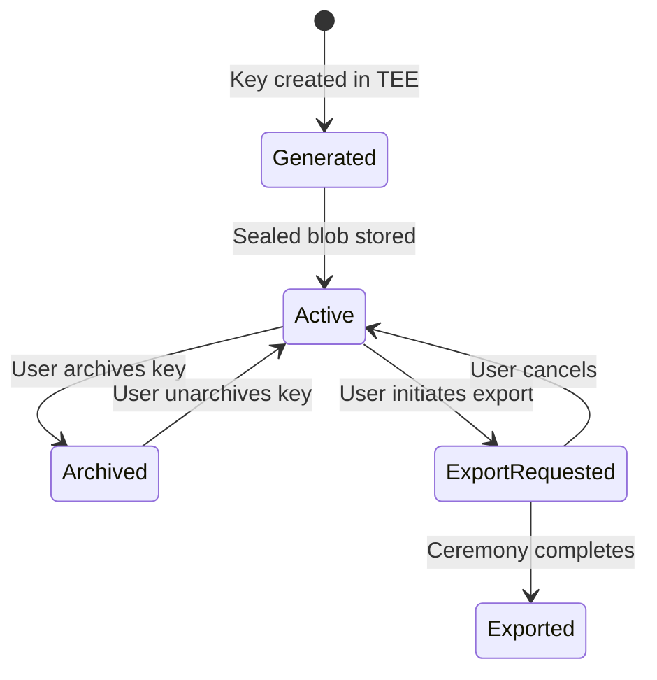

# OpenKey: Transparent Key Custody

**Version 0.1.0**

**Author:** TinyCloud Labs

---

Bitcoin let people hold and transfer value without banks. TinyCloud lets people hold and share data without platforms. OpenKey lets applications sign transactions without ever touching private keys.

---

## Table of Contents

1. [Introduction](#1-introduction)
2. [Transparent Custody](#2-transparent-custody)
3. [Architecture](#3-architecture)
4. [Identity and Keys](#4-identity-and-keys)
5. [Authentication](#5-authentication)
6. [Developer Integration](#6-developer-integration)
7. [Key Export](#7-key-export)
8. [Self-Hosting and Federation](#8-self-hosting-and-federation)
9. [Threat Model and Security](#9-threat-model-and-security)
10. [Future Directions](#10-future-directions)
11. [Conclusion](#11-conclusion)

**Appendices**
- [Appendix A: Key Sealing Protocol](appendix/a-key-sealing.md)
- [Appendix B: Attestation Verification](appendix/b-attestation.md)
- [Appendix C: OAuth 2.1 Implementation](appendix/c-oauth.md)
- [Appendix D: Key Export Ceremony](appendix/d-export-ceremony.md)

---

## 1. Introduction

Every application that interacts with a blockchain needs a signing key. Every user who wants to own digital assets needs a private key. And every private key creates a burden: store it safely, back it up, never lose it, never leak it. This burden falls on users who did not ask for it and are not equipped to handle it.

The result is predictable. Users lose keys and lose access to their assets. Users store keys insecurely and have them stolen. Users give up and hand their keys to custodians who promise to keep them safe. The dream of self-sovereign digital ownership runs aground on the rocks of key management.

### The Custody Spectrum

The industry has converged on two poles. On one end, full custody: exchanges and wallets hold keys on behalf of users, providing convenience at the cost of control. Users trust these custodians not to steal their funds, not to get hacked, not to go bankrupt, not to be compelled by governments to freeze accounts. The history of cryptocurrency is littered with examples of each failure mode.

On the other end, full self-custody: users hold their own keys, typically as seed phrases written on paper or stamped into metal. This approach maximizes control but demands technical sophistication and operational discipline that most people cannot sustain. Seed phrases get lost. Backups get discovered. Hardware wallets get confused with USB drives and thrown away.

Between these poles lies a gap. Users want the convenience of custody and the guarantees of self-custody. They want someone else to handle the complexity of key management while retaining assurance that their assets cannot be seized or stolen. This gap has remained unfilled because the guarantees seemed contradictory: if someone else holds your keys, they can access your funds.

### Transparent Custody

OpenKey fills this gap with a model we call transparent custody. The custodian holds keys on behalf of users, but hardware isolation prevents the custodian from accessing those keys. Remote attestation proves what code is running, and the entire stack is open source so anyone can verify the guarantees.

This is not a compromise between custody and self-custody. It is a new category. The user delegates key management to a service but retains cryptographic assurance that the service cannot abuse that delegation. The trust model shifts from "trust the operator's intentions" to "trust the hardware and verify the code."

### Design Principles

OpenKey is built on four principles:

**Open source.** The entire stack is public. Anyone can read the code, audit the implementation, and verify that the deployed system matches the published source. Closed-source security relies on obscurity; open-source security relies on transparency.

**Hardware verification.** Trusted Execution Environments (TEEs) provide hardware-enforced isolation. Private keys exist only inside encrypted memory regions that even the server operator cannot read. Remote attestation proves that the correct code is running in a genuine TEE.

**Self-hostable.** OpenKey is infrastructure, not a service. Anyone with compatible hardware can run their own instance. Users can choose which instances to trust, and applications can whitelist multiple providers. No single operator controls the network.

**Deliberate export.** Users can always extract their keys through a ceremony that requires multiple verification steps and a waiting period. The ceremony is intentionally not seamless because taking custody of a private key should be a conscious decision.

### Why Now

Transparent custody has been theoretically possible since Intel introduced SGX in 2015, but practical deployment required mature infrastructure. That infrastructure now exists.

Phala Network's dstack provides the foundation. dstack is a framework for deploying containerized applications to TEE hardware with built-in key derivation and attestation services. It abstracts away the complexity of TEE development and makes hardware-verified compute accessible to application developers.

Intel TDX (Trust Domain Extensions) provides the hardware isolation. Unlike SGX, which isolated individual enclaves, TDX isolates entire virtual machines. This simplifies deployment and improves compatibility with existing software.

The combination of dstack and TDX makes it possible to build OpenKey as a standard web application that happens to run inside verified hardware. Developers do not need TEE expertise. Operators do not need custom infrastructure. Users do not need to understand attestation protocols. The complexity is hidden behind familiar interfaces.

### Relationship to TinyCloud

OpenKey is the identity and key management layer of the TinyCloud stack. TinyCloud provides data sovereignty: users own their data and control who can access it. OpenKey provides the cryptographic foundation: the signing keys that authenticate users and authorize operations.

When a TinyCloud user creates a space, delegates access to another user, or invokes a capability, those operations require signatures. OpenKey generates those signatures without exposing private keys to the application layer. The integration is seamless: TinyCloud applications call OpenKey for signing, and OpenKey returns signatures without the application ever handling key material.

This separation of concerns improves security for both systems. TinyCloud does not need to manage keys. OpenKey does not need to understand application semantics. Each system does one thing well.

---

## 2. Transparent Custody

Transparent custody is OpenKey's contribution to the vocabulary of key management. The term describes a specific set of properties that distinguish this approach from both traditional custody and self-custody.

### Definition

A custody model qualifies as transparent when it satisfies five criteria:

1. **Custodial delegation.** The custodian holds keys on behalf of users. Users do not manage key material directly during normal operation.

2. **Hardware isolation.** Trusted Execution Environment hardware prevents the custodian from accessing key material. Keys exist only inside encrypted memory regions.

3. **Remote attestation.** Cryptographic proofs demonstrate what code is running inside the TEE. Clients can verify that the deployed code matches the published source.

4. **Open source.** The entire stack is publicly available. Anyone can audit the code, reproduce the build, and verify the attestation.

5. **User export.** Users can extract their keys through a deliberate ceremony. The custodian cannot prevent export, and export does not require custodian cooperation beyond running the protocol.

These criteria are conjunctive: a system must satisfy all five to qualify as transparently custodial. Missing any one criterion fundamentally changes the trust model.

### Competitor Comparison

Several companies offer key management services. Each makes different tradeoffs.

**Privy** uses 2-of-3 Shamir Secret Sharing. The user holds one share in their browser, Privy holds the auth share, and Privy holds the recovery share. In the default configuration, Privy controls two of three shares, making it effectively custodial. Users can opt into different configurations, but the default grants Privy access to keys. Privy was acquired by Stripe in June 2025, bringing its infrastructure under a large financial services company. The infrastructure is closed source.

**Turnkey** runs inside TEEs on AWS Nitro hardware. Keys never leave the enclave, and attestation proves code integrity. However, Turnkey's enclave applications are proprietary. QuorumOS, their operating system, is open source, but the applications running on it are not. Users trust Turnkey's claims about what code is running rather than verifying it themselves. Additionally, AWS Nitro is a proprietary TEE implementation controlled by Amazon, adding another layer of vendor dependence.

**Para** (formerly Capsule) uses 2-of-2 MPC-TSS (Multi-Party Computation with Threshold Signature Schemes). The key is split between the user's device and Para's servers, and signatures require cooperation from both parties. The key is never assembled in one place. However, Para is a required co-signer for every transaction, creating a liveness dependency. If Para goes offline or refuses to sign, users cannot access their funds. The TSShock vulnerability disclosed in 2023 also demonstrated that MPC implementations can have subtle security flaws.

**OpenKey** is transparently custodial. Keys are held by the operator but isolated by TEE hardware. Intel TDX provides the isolation, which unlike AWS Nitro, is based on open specifications. The entire stack is open source, from the application code to the TEE wrapper. Users can verify attestation, audit code, and export keys without operator cooperation.

### Comparison Table

| Property | OpenKey | Turnkey | Privy | Para |
|----------|---------|---------|-------|------|
| Can operator access keys? | No (TEE) | No (TEE) | Yes (default) | No (MPC) |
| Key ever assembled? | In TEE only | In TEE only | In browser/TEE | Never |
| Hardware trust | Intel TDX (open spec) | AWS Nitro (proprietary) | AWS Nitro (proprietary) | None |
| Open source | Full stack | Partial (QuorumOS only) | Partial | Partial |
| Vendor lock-in | Low | High (AWS) | High (AWS) | Low |
| Provider liveness required? | No | No | Partial (2-of-3) | Yes (2-of-2) |
| Decentralizable | Yes (dstack) | No | No | No |

### Trust Model

Understanding transparent custody requires understanding what you trust, what you verify, and what remains assumed.

| Aspect | What You Trust | What You Verify | What Remains Assumed |
|--------|----------------|-----------------|----------------------|
| Hardware | Intel TDX implementation | Attestation signature chain | No hardware backdoors |
| Code | Published source code | Attestation code measurement | Build reproducibility |
| Operator | Deploys correct code | Attestation proves code identity | Timely code updates |
| Network | dstack infrastructure | Attestation at connection time | KMS availability |
| Cryptography | Standard algorithms | Nothing (formally verified where possible) | No breaks in AES, ECDSA |

The trust model is not zero-trust. You trust Intel to have implemented TDX correctly and to not have inserted backdoors. You trust that the published source code matches your security expectations. You trust that the cryptographic primitives remain secure.

What you do not trust: the operator's intentions. Even a malicious operator cannot extract keys from the TEE because the hardware prevents it. Even a compromised operator cannot sign transactions without user authentication because the code enforces it. The trust boundary surrounds verified hardware and verified code, not human promises.

---

## 3. Architecture

OpenKey is a web service with four main components: a client SDK, an API server, an authentication layer, and a TEE package that interfaces with hardware isolation.

### System Overview

```mermaid
graph TB
    Client[Client Application] --> SDK[@openkey/sdk]
    SDK --> API[OpenKey API<br/>Hono Server]
    API --> Auth[Authentication<br/>better-auth + Passkeys]
    API --> Keys[Key Management<br/>Routes]
    Keys --> TEE[TEE Package<br/>@openkey/tee]
    TEE --> dstack[dstack KMS<br/>HKDF Derivation]
    Keys --> DB[(PostgreSQL<br/>Sealed Blobs)]
    dstack --> TDX[Intel TDX<br/>Hardware]
```

The client application includes the OpenKey SDK, which provides a simple interface for connecting wallets and requesting signatures. The SDK communicates with the OpenKey API over HTTPS, using either popup windows or iframes for user interaction.

The API server runs on Hono, a lightweight web framework. It handles two categories of requests: authentication (managed by better-auth with passkey support) and key operations (generate, sign, list, archive). All key operations require an authenticated session.

The authentication layer uses better-auth with the passkey plugin. Users register with email verification or Google sign-in, then create a passkey for subsequent logins. The passkey binds authentication to hardware, making phishing attacks significantly harder.

The TEE package wraps dstack's SDK to provide key derivation and attestation. In production, it calls dstack's TappdClient to derive keys from hardware secrets. In development, it uses a deterministic mock that derives keys from an environment variable.

PostgreSQL stores user accounts, session data, and sealed key blobs. The database never contains plaintext private keys. Each key record includes the Ethereum address, public key, and an encrypted blob that can only be decrypted inside the TEE.

### dstack Integration

dstack is Phala Network's framework for TEE applications. It provides three critical services:

**Key derivation.** The `deriveKey()` function takes a path string and returns a 256-bit key derived from hardware secrets. The derivation is deterministic: the same path always produces the same key on the same application. This enables stateless sealing where the sealing key is derived rather than stored.

The derivation uses HKDF (HMAC-based Key Derivation Function) with hardware-rooted secrets. The path acts as context information that differentiates keys for different purposes. OpenKey uses paths of the form `openkey/user/{userId}/keys` to derive per-user sealing keys.

**Attestation.** The `tdxQuote()` function generates an Intel TDX quote that proves the code is running inside a genuine TEE. The quote includes a measurement of the running code, allowing verifiers to confirm that the deployed binary matches the expected source.

Clients can request attestation quotes to verify that their keys are protected by real hardware. The quote includes application-specific data (key address, user ID, timestamp) that binds it to a specific request.

**Deployment.** dstack handles the complexity of deploying containers to TDX hardware. Operators specify their application as a Docker image, and dstack manages the TEE lifecycle. This abstraction makes TEE deployment accessible to developers without specialized hardware expertise.

### Key Sealing

Private keys are sealed using AES-256-GCM with TEE-derived keys. The sealing process:

```typescript
const sealingKey = await tee.deriveKey(`openkey/user/${userId}/keys`);
const sealedBlob = await seal(privateKey, sealingKey);
```

The `seal()` function generates a random 12-byte IV, encrypts the private key with AES-256-GCM, and produces an authentication tag. The output format is: IV (12 bytes) + authTag (16 bytes) + ciphertext, base64 encoded.

Unsealing reverses the process:

```typescript
const sealingKey = await tee.deriveKey(`openkey/user/${userId}/keys`);
const privateKey = await unseal(sealedBlob, sealingKey);
```

The sealing key is derived, not stored. Even if an attacker copies the database, they cannot decrypt the blobs without running the same code inside an attested TEE. The TEE hardware enforces this constraint.

### Derivation Paths

The whitepaper specifies per-key derivation paths: `openkey/user/{userId}/keys/{keyIndex}`. This would give each key its own sealing key, limiting the blast radius if any single key's encryption is compromised.

The current implementation uses per-user paths: `openkey/user/{userId}/keys`. All keys for a user share a sealing key. This simplifies the implementation but means compromising one key's sealing key compromises all keys for that user.

The protocol specification includes per-key paths for future migration when the security benefit justifies the complexity.

---

## 4. Identity and Keys

OpenKey manages Ethereum-compatible signing keys. Each key is an ECDSA keypair on the secp256k1 curve, producing 20-byte addresses and 65-byte signatures compatible with Ethereum and all EVM chains.

### User Identity

Users are identified by their Ethereum address in DID format: `did:pkh:eip155:{chainId}:{address}`. This format follows the did:pkh specification for blockchain-based decentralized identifiers.

The identity is instance-agnostic. A user's DID depends only on their Ethereum address, not on which OpenKey instance manages their key. This enables portability: users can export their key from one instance and import it to another without changing their identity.

The EVM compatibility extends beyond Ethereum mainnet. The same key works on Polygon, Arbitrum, Optimism, Base, and any other EVM-compatible chain. Applications specify the chain ID when needed, but the key itself is chain-neutral.

### Key Types

The database schema defines two key types:

**MANAGED keys** are generated inside the TEE and sealed for storage. The schema includes:
- `id`: Unique identifier (CUID)
- `address`: Ethereum address (unique constraint)
- `publicKey`: Public key bytes
- `sealedBlob`: AES-256-GCM encrypted private key
- `keyIndex`: Sequential index for this user's keys
- `label`: User-defined name for the key
- `archivedAt`: Soft-delete timestamp (null if active)

MANAGED keys are the primary key type. Users create them through the OpenKey interface, and applications request signatures through the API.

**EXTERNAL keys** represent user wallets linked via challenge-response. The schema exists but the feature is not fully implemented. When complete, users will be able to prove ownership of existing wallets and use OpenKey as a unified identity provider across both managed and external keys.

### Key Lifecycle

Keys progress through a defined lifecycle:



**Generation.** When a user requests a new key, the TEE generates a random private key using a cryptographically secure random number generator. The key is immediately sealed and stored. The plaintext private key exists only briefly in TEE memory.

**Primary key.** Every user has a primary key (Key 0) created automatically during registration. This key is the default for signing operations when no key is specified.

**Multi-key.** Users can generate additional managed keys, each with an incrementing `keyIndex`. This supports use cases like separate keys for different applications or rotating keys without abandoning the old address.

**Archive.** Archiving sets the `archivedAt` timestamp but does not delete the key. Archived keys are hidden from the default key list but remain recoverable. This prevents accidental loss while allowing users to remove keys from active use.

**Export.** The export ceremony (detailed in Section 7) produces a plaintext private key that the user can import into any standard wallet. After export, the key remains in OpenKey, and the user holds an independent copy.

---

## 5. Authentication

OpenKey uses passkeys as the primary authentication mechanism. Passkeys are WebAuthn credentials bound to hardware security modules on user devices, providing strong authentication without passwords.

### Passkey-First Model

Traditional web authentication relies on passwords, which have well-documented weaknesses: users choose weak passwords, reuse passwords across sites, fall for phishing attacks, and forget passwords. Each failure mode creates support burden or security incidents.

Passkeys eliminate these problems. The credential is generated by the device's secure hardware and never leaves it. Authentication requires proving possession of the private key, which the device does through a cryptographic challenge-response. The user experience is biometric unlock or PIN entry, not password typing.

OpenKey requires passkeys for login. Email and password authentication is disabled. This is a deliberate choice that prioritizes security over familiarity.

### Registration Flow

New users register through one of two paths:

1. **Email verification.** User enters email, receives a 6-digit OTP, enters it to verify ownership. OpenKey uses Resend for email delivery.

2. **Google sign-in.** User authenticates with Google OAuth, which verifies the email address through Google's infrastructure.

Either path establishes that the user controls an email address. After email verification, the user must create a passkey. This step is mandatory. Users cannot complete registration without binding a passkey to their account.

During passkey creation, OpenKey also generates the user's primary Ethereum key (Key 0) inside the TEE. Registration completes with the user having both authentication credentials (passkey) and signing capability (Ethereum key).

### Login Flow

Subsequent logins use passkey authentication exclusively:

1. User initiates login
2. OpenKey sends a WebAuthn challenge
3. User's device signs the challenge with the passkey private key
4. OpenKey verifies the signature against the stored public key
5. Session token issued (7-day expiration)

No passwords are involved. The passkey credential cannot be phished because WebAuthn binds the credential to the origin. A fake openkey.so site cannot request a challenge for the real openkey.so credential.

### Session Management

Sessions expire after 7 days and refresh every 24 hours. The refresh mechanism extends the session without requiring re-authentication, balancing security (eventual expiration) with convenience (not logging users out mid-task).

Session tokens are stored in the database and validated on each authenticated request. The middleware extracts the session token from cookies, looks up the associated user, and attaches user context to the request for route handlers.

### WebAuthn Configuration

The WebAuthn Relying Party configuration:
- `rpID`: `openkey.so` (or `localhost` in development)
- `rpName`: `OpenKey`
- `origin`: `https://openkey.so` (or `http://localhost:5173` in development)

The rpID must match the domain where authentication occurs. This binding prevents credential portability across domains, which is a security feature, not a limitation.

### Why Passkeys

Passkeys provide defense against the most common authentication attacks:

**Phishing resistance.** The credential is bound to the origin at creation time. Even if a user visits a convincing fake site, their passkey will not work because the origin does not match.

**Hardware binding.** The private key lives in secure hardware (TPM, Secure Enclave, or equivalent). Malware running on the device cannot extract the credential.

**No shared secrets.** The server stores only public keys. A database breach does not expose credentials that can be used to impersonate users.

**Replay resistance.** Each authentication includes a challenge from the server, preventing captured authentication traffic from being replayed.

The main drawback is device dependence: losing all devices with passkeys means losing account access. This is why recovery mechanisms (not yet implemented) will be important for production deployment.

---

## 6. Developer Integration

Applications integrate with OpenKey through OAuth 2.1 for authentication and a JavaScript SDK for signing operations.

### OAuth 2.1 with PKCE

OpenKey implements OAuth 2.1 as an identity provider, allowing third-party applications to authenticate users and request signing permissions. The implementation uses better-auth's oauthProvider plugin.

**Client registration.** Applications must pre-register with OpenKey to receive a client ID. Dynamic client registration is disabled to prevent abuse. Registered clients specify:
- Allowed redirect URIs
- Application name and icon
- Requested scopes

**Authorization flow.** Applications redirect users to `/api/auth/oauth2/authorize` with standard OAuth parameters:

```
GET /api/auth/oauth2/authorize
  ?client_id=app_xxx
  &redirect_uri=https://app.example.com/callback
  &response_type=code
  &scope=openid
  &state=random_state
  &code_challenge=S256_challenge
  &code_challenge_method=S256
```

The user authenticates with their passkey (if not already logged in) and sees a consent screen showing which application is requesting access. After consent, OpenKey redirects to the application's callback URL with an authorization code.

**Token exchange.** The application exchanges the authorization code for tokens:

```
POST /api/auth/oauth2/token
Content-Type: application/x-www-form-urlencoded

grant_type=authorization_code
&code=auth_code
&redirect_uri=https://app.example.com/callback
&client_id=app_xxx
&code_verifier=original_verifier
```

The response includes:
- `access_token`: 1-hour validity, used for API requests
- `refresh_token`: 7-day validity, used to obtain new access tokens
- `id_token`: JWT containing user identity claims

**Scopes.** Currently, OpenKey supports only the `openid` scope, which provides minimal identity verification. The ID token contains the user's DID (`did:pkh:eip155:{chainId}:{address}`) in the `sub` claim.

**PKCE.** All authorization requests require PKCE (Proof Key for Code Exchange) with S256 code challenge method. The SDK generates a random code verifier, hashes it to create the challenge, and includes the verifier during token exchange. This prevents authorization code interception attacks.

### SDK Usage

The JavaScript SDK provides a high-level interface for connecting to OpenKey and requesting signatures:

```typescript
import { OpenKey } from '@openkey/sdk';

const ok = new OpenKey({ host: 'https://openkey.so' });

// Connect and get user's wallet address
const { address, keyId } = await ok.connect();

// Sign a message (EIP-191 personal_sign)
const { signature } = await ok.signMessage({
  message: 'Hello from my app'
});

// Sign typed data (EIP-712)
const { signature: typedSig } = await ok.signTypedData({
  domain: {
    name: 'MyApp',
    version: '1',
    chainId: 1,
    verifyingContract: '0x...'
  },
  types: {
    Message: [{ name: 'content', type: 'string' }]
  },
  primaryType: 'Message',
  message: { content: 'Hello' },
});
```

The SDK handles the complexity of opening widgets, managing postMessage communication, and parsing responses.

### Widget Transport

The SDK supports two transport mechanisms:

**Popup (default).** Opens a new browser window to `openkey.so/widget/[action]`. The popup handles authentication if needed, displays the signing request, and returns the result via postMessage. Popups work across all browsers but may be blocked by popup blockers.

**Iframe.** Embeds the widget in an overlay on the current page. This avoids popup blockers but requires the parent page to allow framing from openkey.so. The iframe approach provides a more integrated experience at the cost of some security isolation.

Both transports use the same postMessage protocol:
- `openkey:ready` - Widget loaded, parent can send request
- `openkey:auth:request/response` - Connect flow
- `openkey:sign:request/response` - Message signing
- `openkey:signTypedData:request/response` - EIP-712 signing
- `openkey:close` - User cancelled

### Signing Formats

OpenKey supports three signing formats:

**EIP-191 (personal_sign).** The default format, which prefixes the message with `\x19Ethereum Signed Message:\n{length}` before hashing and signing. This format is standard for human-readable messages and prevents signed messages from being valid transactions.

**EIP-712 (typed data).** Structured data signing that encodes type information into the signed hash. This format is used for complex data structures and provides better UX because wallets can display structured data meaningfully.

**Raw signing.** Signs the message bytes directly without any prefix. This format is needed for protocols that define their own signing schemes, but applications should prefer EIP-191 or EIP-712 when possible.

---

## 7. Key Export

Users can export their private keys from OpenKey through a deliberate ceremony. The ceremony is designed to be inconvenient enough to prevent accidental export while remaining accessible to users who genuinely need their keys.

### Design Intent

Key export is intentionally not seamless. Taking custody of a private key is a significant decision with permanent consequences. If you lose the key, no one can recover it. If you leak the key, your assets can be stolen. If you store the key insecurely, you have negated all the security that OpenKey provides.

The export ceremony creates friction to ensure users understand what they are doing. Multiple verification steps confirm user intent. A waiting period provides time to reconsider. Email notifications alert users to export attempts they did not initiate.

This design reflects a philosophy: ease of use should not compromise security for operations that are inherently dangerous.

### Ceremony Steps

The export ceremony proceeds through seven steps:

1. **Request export.** User selects a specific key and initiates the export process through the OpenKey interface.

2. **Email confirmation.** OpenKey sends a verification email with a one-time code. This confirms the user has access to the registered email address.

3. **Passkey verification.** User authenticates with their passkey. This confirms the user has access to the registered device.

4. **24-hour delay.** After both verifications complete, a 24-hour timer begins. The export cannot proceed until the timer expires.

5. **Cancellation window.** At any point during the 24 hours, the user can cancel the export. A reminder email is sent 4 hours before the timer expires.

6. **Encrypted export.** When the user returns after 24 hours to complete the export, they generate an ephemeral X25519 keypair locally. The public key is sent to OpenKey, which uses HPKE (Hybrid Public Key Encryption) inside the TEE to encrypt the private key to that recipient.

7. **Local decryption.** The encrypted blob is returned to the user's client, which decrypts it with the ephemeral private key. The plaintext private key is displayed to the user, who must securely store it.

### Security Properties

The ceremony provides several security properties:

**Attacker notification.** If an attacker compromises both the user's email and passkey, the 24-hour delay and reminder email give the user a chance to notice the unauthorized export attempt.

**No server-side plaintext.** The private key is encrypted to an ephemeral key generated on the client. The server never sees the plaintext during export, even inside the TEE. (The TEE unseals the key and immediately re-encrypts it to the client's ephemeral key.)

**One-time use.** The ephemeral keypair is generated fresh for each export. Even if the encrypted blob is intercepted, it cannot be decrypted without the ephemeral private key, which exists only in the client's memory.

**Audit trail.** All export requests are logged with timestamps. Users can review export history to detect unauthorized attempts.

### Implementation Status

The key export ceremony is specified but not yet implemented. The current implementation allows key generation, signing, and archiving. Export will be added in a future release following the protocol specified in Appendix D.

---

## 8. Self-Hosting and Federation

OpenKey is designed as infrastructure that anyone can run. The hosted instance at openkey.so is a convenience, not a requirement. Organizations that need more control can deploy their own instances.

### Running Your Own Instance

Self-hosting requires:

- **TDX-compatible hardware.** Intel servers with TDX support, or cloud instances that expose TDX (currently available from select providers).
- **dstack deployment.** The application runs as a Docker container deployed through dstack.
- **PostgreSQL database.** Standard PostgreSQL for storing user accounts and sealed key blobs.
- **Domain and TLS.** HTTPS is required for WebAuthn, which requires a domain name and TLS certificate.

The deployment process:
1. Clone the OpenKey repository
2. Configure environment variables (database URL, email API key, WebAuthn settings)
3. Build the Docker image
4. Deploy through dstack to TDX hardware
5. Configure DNS and TLS termination

Detailed deployment documentation is planned but not yet written.

### Trust Model for Self-Hosting

Self-hosted instances have a two-layer trust model:

**Attestation layer.** Clients can request TDX quotes from any OpenKey instance. The quote proves that the instance is running specific code inside genuine TDX hardware. Clients who verify attestation trust the hardware and the code, not the operator.

**Discovery layer.** Applications must know which OpenKey instances to accept. This is configured through OIDC discovery: applications whitelist instances by domain, and each instance publishes its configuration at `.well-known/openid-configuration`.

These layers are independent. An application might trust any instance with valid attestation (maximum decentralization) or only specific instances on a whitelist (maximum control). The choice depends on the application's security requirements.

### Instance Independence

User identity is instance-agnostic. A `did:pkh:eip155:1:0x...` identifier refers to an Ethereum address, not to an OpenKey instance. Users can export their key from one instance and import it to another (or to any standard wallet) without changing their identity.

This independence prevents lock-in. If an operator becomes unreliable, users can migrate. If a user wants to self-custody, they can export. The OpenKey instance is a convenience layer over a portable identity.

### Cross-Instance Trust

Applications that want to accept users from multiple OpenKey instances need a trust framework. The proposed approach:

1. Application maintains a whitelist of trusted instance domains
2. During authentication, application checks that the token issuer is on the whitelist
3. Application optionally verifies attestation to confirm the instance is running expected code

This model allows different applications to make different trust decisions. A high-security financial application might trust only instances it operates. A social application might trust any instance with valid attestation. A testing application might trust even non-TEE development instances.

### Implementation Status

Self-hosting documentation and OIDC discovery are specified but not yet implemented. The current implementation assumes a single hosted instance. Federation support will be added in a future release.

---

## 9. Threat Model and Security

Security analysis requires honesty about what the system protects against and what it does not. OpenKey's threat model has three primary concerns, each with different mitigation strategies.

### Threat 1: Infrastructure Trust (Phala KMS)

dstack's key derivation service is currently centralized within Phala's infrastructure. When OpenKey calls `deriveKey()`, the request goes to Phala's KMS, which derives the key from hardware secrets and returns it.

**The risk:** A compromised or coerced Phala could log derived keys during the derivation call. There is no cryptographic proof that the KMS is not logging. The attestation proves what code is running in the OpenKey enclave, but the KMS itself is a separate trust domain.

**Mitigations:**
- Phala's reputation depends on not abusing this position
- The derivation happens inside TEE hardware, limiting the attack surface
- Keys are derived on-demand rather than stored, reducing the window for interception
- The roadmap includes decentralizing KMS across multiple operators

**Honest assessment:** This is a real trust assumption. Users who cannot accept this assumption should not use OpenKey (or any dstack-based system) until KMS decentralization is complete.

### Threat 2: Authentication Attacks

The cryptographic security of TEE-sealed keys is irrelevant if an attacker can authenticate as the user. Authentication is the practical attack surface.

**Attack vectors:**
- Passkey phishing (mostly mitigated by WebAuthn origin binding, but sophisticated attacks exist)
- Compromised email account (enables password reset, if passwords were used)
- Stolen device with unlocked passkey
- Session token theft through XSS or network interception

**Mitigations:**
- Passkey-first authentication eliminates password-based attacks
- WebAuthn origin binding makes credential phishing difficult
- Sensitive operations (like export) require fresh authentication
- Session tokens are HTTP-only cookies with secure flags
- HTTPS required for all production traffic

**Honest assessment:** If an attacker controls your email and has physical access to your unlocked device with your passkey, they can sign transactions with your keys. This is true of any authentication system. The 24-hour export delay provides a window to detect and respond to account compromise.

### Threat 3: Operator and Code Integrity

The operator deploys the code that runs inside the TEE. While attestation proves what code is running, it does not prevent the operator from deploying malicious code.

**The risk:** An operator could deploy a modified version of OpenKey that exfiltrates keys before signing. By the time users verify attestation, the keys may already be compromised.

**Mitigations:**
- Open source allows anyone to audit the code
- Reproducible builds (planned) will allow verification that deployed binaries match source
- Attestation verification catches unauthorized code after deployment
- Multiple independent operators (through federation) reduce single-point-of-failure risk

**Honest assessment:** Users trust that the code they audited is the code that was deployed. Reproducible builds will provide cryptographic verification of this, but until then, users trust the operator to deploy the published code.

### Shared TEE Limitation

All TEE-based systems share a fundamental limitation: private keys exist in plaintext in enclave memory during signing. The TEE encrypts memory at rest and prevents external access, but the CPU must decrypt keys to use them.

**Implications:**
- Side-channel attacks (Spectre, timing attacks) could potentially extract keys from TEE memory
- Hardware bugs in TDX implementation could expose keys
- Physical attacks on the server could potentially extract keys

These attacks are sophisticated and require significant resources, but they are not impossible. Turnkey's multi-enclave architecture (separate Signer, Policy Engine, Notarizer, Parser, and TLS Fetcher enclaves) provides defense-in-depth by limiting what each enclave can do. OpenKey's future roadmap includes similar architectural improvements.

### What OpenKey Does NOT Protect Against

- **Compromised user devices:** If malware controls your device, it can intercept signing requests and responses.
- **Rubber hose attacks:** If someone coerces you into authenticating, OpenKey cannot distinguish coerced authentication from voluntary.
- **Application-layer attacks:** If the application requesting a signature is malicious, OpenKey signs what it is asked to sign.
- **Intel compromise:** If Intel has backdoors in TDX, all bets are off.
- **Quantum computers:** ECDSA signatures are vulnerable to quantum attacks. This is a long-term concern for all blockchain systems.

---

## 10. Future Directions

OpenKey's current implementation provides a foundation. Several architectural improvements are planned.

### Multi-Enclave Separation

The current architecture runs all operations in a single enclave. Turnkey's QuorumOS demonstrates a more robust approach: separate enclaves for different functions, each with minimal privileges.

**Planned enclave separation:**
- **Signer enclave:** Only function is to unseal keys and produce signatures. Cannot communicate with the network.
- **Policy Engine enclave:** Evaluates signing policies. Cannot access key material.
- **Notarizer enclave:** Logs all operations. Cannot access keys or modify policies.
- **API enclave:** Handles network communication. Cannot access keys directly.

This separation limits the blast radius of any single compromise. Even if the API enclave is compromised, it cannot extract keys because it never has access to them.

### In-Enclave Policy Engine

Current signing operations require only authentication. Future versions will support policies that constrain what can be signed:

- Daily spending limits
- Whitelisted contract addresses
- Required multi-party approval
- Time-based restrictions

Policies will be evaluated inside the Policy Engine enclave using CEL (Common Expression Language), a simple expression language suitable for security policies.

### Decentralized KMS

The current dependency on Phala's centralized KMS is a trust assumption we want to eliminate. The long-term goal is a decentralized KMS operated by multiple independent parties:

- Key derivation requires threshold agreement from multiple KMS operators
- No single operator can derive keys unilaterally
- Byzantine fault tolerance ensures availability even if some operators fail

This architecture requires coordination protocols and economic incentives that are still being designed.

### Reproducible Builds

Users should be able to verify that the deployed code matches the published source. Reproducible builds produce identical binaries from identical source code, regardless of who builds them.

**Planned approach:**
- Deterministic Docker builds
- Published build instructions
- Attestation includes code measurement that users can independently compute

With reproducible builds, users can audit the source code, build it themselves, and verify that the attestation measurement matches their build.

### On-Chain Attestation Registry

Attestation verification currently requires each client to validate TDX quotes. An on-chain registry would allow:

- Publishing attestation measurements for verified builds
- Checking instance attestation against registry
- Slashing operators who deploy unverified code

This adds a coordination layer that makes it easier for users and applications to verify OpenKey instances.

### TinyCloud Deep Integration

OpenKey is the identity layer for TinyCloud. Deeper integration will enable:

- Signing space creation transactions
- Producing delegation credentials
- Authenticating capability invocations

This integration will make TinyCloud's data sovereignty layer seamlessly accessible to applications that use OpenKey for identity.

---

## 11. Conclusion

OpenKey introduces transparent custody as a new model for key management. The model occupies the space between traditional custody (convenient but requires trusting the custodian) and self-custody (trustless but operationally demanding). Transparent custody provides the convenience of delegation with hardware-verified guarantees that the custodian cannot abuse the delegation.

The key innovations are architectural rather than cryptographic. OpenKey uses standard algorithms (AES-256-GCM, ECDSA, HKDF) and standard protocols (OAuth 2.1, WebAuthn). The contribution is assembling these components in a way that provides strong security properties while remaining accessible to ordinary users and developers.

Three elements make this possible:

**Open source as foundation.** Every line of code is public. Security through obscurity is replaced by security through transparency. Anyone can audit the implementation, find bugs, suggest improvements, or fork the project.

**dstack as enabling infrastructure.** Phala's framework abstracts the complexity of TEE development. OpenKey is a standard web application that happens to run in verified hardware. This accessibility is what makes transparent custody practical rather than theoretical.

**Passkeys as authentication.** WebAuthn credentials provide phishing-resistant authentication that binds to hardware. The weakest link in most systems is authentication, and passkeys significantly raise the bar.

We invite the community to participate in OpenKey's development. Self-host your own instance. Audit the code. Report bugs. Propose improvements. The security of transparent custody depends on community verification, and verification requires participation.

OpenKey is public infrastructure for key management. Like other infrastructure, it should be open, auditable, and available to all.

---

## Implementation Status

This whitepaper describes both implemented features and protocol specifications. The following table tracks current status:

| Feature | Status |
|---------|--------|
| TEE key sealing (AES-256-GCM) | Implemented |
| Passkey authentication | Implemented |
| OAuth 2.1 provider | Implemented |
| SDK (popup/iframe widget) | Implemented |
| EIP-191 and EIP-712 signing | Implemented |
| TEE attestation quotes | Implemented |
| Key archive/unarchive | Implemented |
| Per-key derivation paths | Specified (current: per-user) |
| External key linking | Specified (schema exists) |
| Key export ceremony | Specified |
| Self-hosting documentation | Specified |
| OIDC discovery | Specified |
| Multi-enclave separation | Future |
| In-enclave policy engine | Future |
| Decentralized KMS | Future |
| Reproducible builds | Future |
| On-chain attestation registry | Future |

---

## References

1. Intel Corporation. "Intel Trust Domain Extensions (Intel TDX)." Intel Architecture Specification, 2023.

2. Phala Network. "dstack: Trustless Cloud for Confidential Dapps." https://docs.phala.network/dstack

3. Turnkey. "QuorumOS: A Minimal, Immutable Linux Distribution for Secure Enclaves." https://github.com/tkhq/qos

4. Trail of Bits. "Security Assessment of AWS Nitro System." Technical Report, 2023.

5. Fireblocks. "TSShock: Breaking MPC Wallets and Digital Custodians for $BILLIONS$." Security Disclosure, 2023.

6. Hess, A., Green, M. "The Non-Custodial Fallacy." a]16z crypto, 2023.

7. W3C. "Web Authentication: An API for accessing Public Key Credentials." W3C Recommendation, 2021.

8. IETF. "OAuth 2.1." RFC Draft, 2024.

9. IETF. "Hybrid Public Key Encryption (HPKE)." RFC 9180, 2022.

10. Decentralized Identity Foundation. "did:pkh Method Specification." https://github.com/w3c-ccg/did-pkh

11. Ethereum Foundation. "EIP-191: Signed Data Standard." Ethereum Improvement Proposals.

12. Ethereum Foundation. "EIP-712: Typed structured data hashing and signing." Ethereum Improvement Proposals.

---

*OpenKey is open source software released under the MIT license. For the reference implementation, see [github.com/tinycloudlabs/openkey](https://github.com/tinycloudlabs/openkey).*
