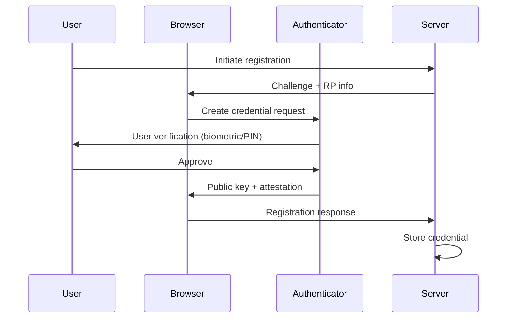
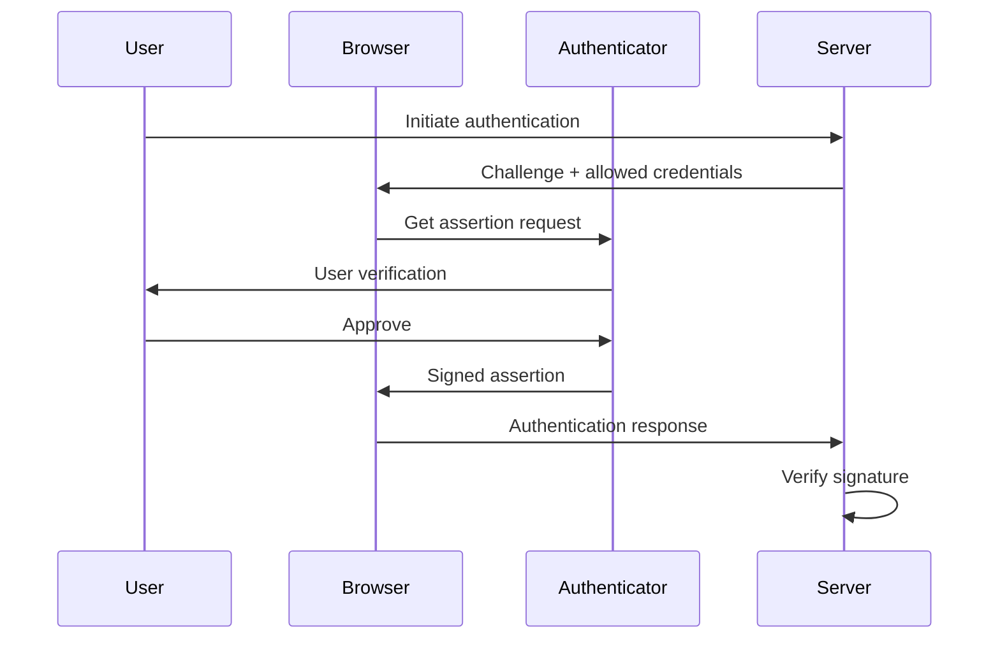
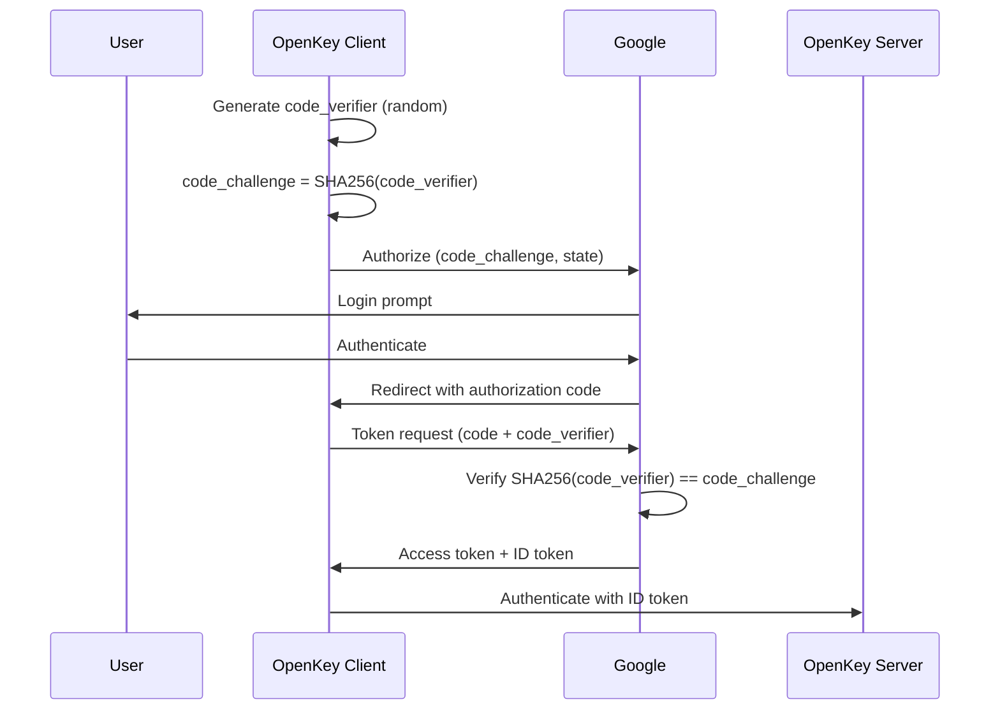

# Appendix A: Background Technologies

This appendix provides technical background on the core technologies that OpenKey builds upon: Trusted Execution Environments, the dstack framework, Passkeys, OAuth 2.1, and Decentralized Identifiers.

## TEE Concepts

### What is a Trusted Execution Environment

A Trusted Execution Environment (TEE) provides an isolated compute environment where code executes with hardware-enforced confidentiality and integrity guarantees. The CPU itself enforces these boundaries, preventing even privileged software (hypervisors, operating systems, firmware) from accessing the protected memory regions. TEEs enable a new computing paradigm where users can verify what code runs on remote hardware without trusting the hardware operator.

The three fundamental properties of TEEs are:

1. **Confidentiality**: Memory contents remain encrypted and inaccessible to external observers, including the host operating system and physical memory attacks.

2. **Integrity**: The TEE detects any tampering with the executing code or its data, preventing unauthorized modifications.

3. **Attestation**: The TEE produces cryptographic proof of its identity and state, allowing remote parties to verify exactly what code runs inside the enclave.

### Intel TDX (Trust Domain Extensions)

Intel TDX represents the evolution of Intel's confidential computing strategy, providing VM-level isolation rather than the application-level isolation of its predecessor SGX. TDX creates Trust Domains (TDs) — entire virtual machines that run with hardware-enforced memory encryption and isolation.

Key architectural differences from SGX:

| Property | SGX | TDX |
|----------|-----|-----|
| Isolation level | Application (enclave) | Virtual machine |
| Memory limit | 128-256 MB (practical) | Terabytes |
| Programming model | SDK-specific, partition app | Standard VM, unmodified apps |
| TCB size | Smaller (just enclave code) | Larger (full VM + kernel) |
| Compatibility | Requires app rewrite | Run existing software |

TDX achieves isolation through several mechanisms:

- **Memory encryption**: The CPU encrypts all TD memory with a unique key, decrypting only when accessed by the TD itself.
- **Secure EPT**: A separate Extended Page Table controlled by the TDX module prevents the hypervisor from mapping TD memory.
- **SEAM module**: A CPU-resident security module mediates all interactions between TDs and the hypervisor.

OpenKey chose TDX because it allows running standard containerized applications without modification while still providing strong isolation guarantees.

### AMD SEV-SNP

AMD Secure Encrypted Virtualization with Secure Nested Paging (SEV-SNP) provides comparable VM-level confidential computing on AMD processors. SEV-SNP adds integrity protection and attestation to AMD's earlier SEV technology. While OpenKey currently targets Intel TDX, the architecture remains portable to SEV-SNP deployments with appropriate attestation adaptations.

## dstack Framework

### Overview

dstack is Phala Network's open-source confidential computing framework, contributed to the Linux Foundation's Confidential Computing Consortium (CCC). It provides the runtime infrastructure for deploying containerized applications into TDX enclaves with minimal friction.

The framework handles the complexity of TEE deployment:
- Container orchestration within Trust Domains
- Key derivation and management
- Remote attestation certificate generation
- Secure communication channels

### KMS: Deterministic Key Derivation

The dstack Key Management Service provides deterministic, stateless key derivation. Rather than storing keys, it derives them on-demand from a combination of hardware-bound secrets and application identity.

The derivation formula:

```
derived_key = HKDF(
  IKM: master_secret,
  salt: compose_hash,
  info: derivation_path,
  length: 32
)
```

Where:
- **master_secret**: A hardware-bound secret derived from CPU fuses and platform configuration. This secret never leaves the TEE and cannot be extracted even by Intel.
- **compose_hash**: A hash of the docker-compose configuration that deployed the application. This binds keys to a specific deployment configuration.
- **derivation_path**: An application-specified string that creates distinct keys for different purposes.

This stateless design means:
- No key database to compromise
- Keys survive container restarts (same inputs produce same outputs)
- Different applications get cryptographically independent keys
- Different paths within an application get independent keys

### RA-TLS: Remote Attestation over TLS

RA-TLS embeds TEE attestation evidence directly into TLS certificates, allowing standard TLS clients to verify they communicate with a genuine TEE. The TDX quote becomes an X.509 certificate extension, and the certificate's public key corresponds to a key generated inside the TEE.

The verification flow:

1. TEE generates an ephemeral key pair inside the enclave
2. TEE requests a TDX quote binding the public key to the enclave measurement
3. TEE constructs a self-signed certificate with the quote as an extension
4. Client connects via TLS, receives the certificate
5. Client extracts and verifies the TDX quote
6. Successful verification proves the TLS endpoint runs inside a genuine TEE

### Container Deployment

dstack accepts standard Docker containers and deploys them into TDX Trust Domains. The deployment process:

1. Operator provides a docker-compose.yaml defining the application
2. dstack computes the compose hash (deterministic hash of the configuration)
3. dstack launches a TDX TD with the dstack daemon
4. The daemon pulls and runs the specified containers inside the TD
5. Containers communicate with the daemon via Unix socket

No application modifications required — existing containers work unmodified.

### Communication: Unix Socket Interface

Applications communicate with the dstack daemon through a Unix domain socket at `/var/run/dstack.sock`. This socket provides access to TEE services:

- Key derivation requests
- TDX quote generation
- Configuration queries

The socket exists only inside the TD, preventing external access to these services.

### TappdClient API

The TappdClient provides a TypeScript interface to dstack services:

```typescript
import { TappdClient } from '@aspect14/tappd-client';

const client = new TappdClient();

// Derive a 32-byte key for a specific purpose
const sealingKey: Uint8Array = await client.deriveKey('openkey/user/123/keys');

// Generate a TDX quote binding arbitrary data
const quote: string = await client.tdxQuote(reportData);
```

The `deriveKey` method returns raw bytes suitable for use as symmetric encryption keys. The `tdxQuote` method returns a base64-encoded TDX quote structure that remote parties can verify.

## Passkeys and WebAuthn

### What are Passkeys

Passkeys are FIDO2 credentials stored in hardware security modules — either platform authenticators (TPM, Secure Enclave, Android Keystore) or roaming authenticators (hardware security keys like YubiKeys). They replace passwords with public-key cryptography, eliminating shared secrets from the authentication flow.

A passkey consists of:
- A private key that never leaves the authenticator hardware
- A public key registered with the relying party (the service)
- A credential ID that identifies this specific passkey
- Metadata including the relying party ID and user handle

### WebAuthn Protocol

WebAuthn (Web Authentication) is the W3C standard that enables passkey-based authentication in web browsers. It defines two ceremonies:

**Registration (Creating a Credential)**



**Authentication (Using a Credential)**



### Why Passkeys Over Passwords

Passkeys provide several security advantages:

1. **Phishing resistance**: Passkeys bind to the relying party's origin. A credential created for `openkey.so` cannot authenticate to `openkey-phishing.com`, even if the user attempts to use it there.

2. **No shared secrets**: The server stores only public keys. A database breach exposes nothing an attacker can use to impersonate users.

3. **Hardware protection**: Private keys exist only in tamper-resistant hardware. Software malware cannot extract them.

4. **Replay resistance**: Each authentication includes a server-provided challenge, preventing replay of captured authentication traffic.

### Platform vs Roaming Authenticators

**Platform authenticators** integrate into the device:
- Apple devices: Secure Enclave (Touch ID, Face ID)
- Windows: TPM with Windows Hello
- Android: Android Keystore with biometrics

**Roaming authenticators** connect externally:
- USB security keys (YubiKey, Titan)
- NFC security keys
- Bluetooth security keys

OpenKey supports both types, allowing users to choose their preferred authenticator.

### Relying Party ID and Origin Binding

The Relying Party ID (rpID) is typically the domain of the service (e.g., `openkey.so`). Credentials bind to this rpID and the origin (`https://openkey.so`). The authenticator enforces these bindings:

- During registration: the authenticator records the rpID
- During authentication: the authenticator verifies the rpID matches before signing

This binding occurs in hardware, outside the browser's control, providing the foundation for phishing resistance.

## OAuth 2.1 and PKCE

### What is OAuth 2.1

OAuth 2.1 consolidates best practices from OAuth 2.0 and its security extensions into a single specification. Key changes from 2.0:

- PKCE required for all clients (not just public clients)
- Implicit grant removed (was vulnerable to token leakage)
- Resource Owner Password grant removed (exposed credentials to clients)
- Refresh token rotation recommended
- Exact redirect URI matching required

OpenKey uses OAuth 2.1 to integrate with identity providers like Google, enabling "Sign in with Google" flows.

### Authorization Code Flow with PKCE

PKCE (Proof Key for Code Exchange) prevents authorization code interception attacks. The flow:



The code_verifier is a cryptographically random string (43-128 characters). The code_challenge is its SHA-256 hash, base64url-encoded. An attacker who intercepts the authorization code cannot exchange it without the code_verifier, which never leaves the legitimate client.

### Why PKCE Matters

Without PKCE, public clients (browser apps, mobile apps) were vulnerable to authorization code interception through:

- Malicious browser extensions observing redirects
- Custom URL scheme hijacking on mobile
- Referrer header leakage

PKCE binds the authorization code to the client that initiated the flow, making intercepted codes useless to attackers.

## DIDs (Decentralized Identifiers)

### What are DIDs

Decentralized Identifiers (DIDs) are a W3C standard for creating globally unique, cryptographically verifiable identifiers without centralized registration authorities. A DID resolves to a DID Document containing public keys and service endpoints.

General DID structure:

```
did:method:method-specific-identifier
```

Examples:
- `did:web:example.com` — resolved via HTTPS
- `did:key:z6Mk...` — self-contained key encoding
- `did:pkh:eip155:1:0x6a12...` — derived from blockchain address

### did:pkh Method

The `did:pkh` (Public Key Hash) method derives DIDs from blockchain addresses. It requires no registration — the DID exists implicitly from the address.

Format:
```
did:pkh:chain-namespace:chain-reference:account-address
```

For Ethereum mainnet:
```
did:pkh:eip155:1:0x6a12D4e911703df11Fdf9F17e35DCe07E41dC04B
```

Components:
- `pkh` — the DID method
- `eip155` — CAIP-2 namespace for EVM chains
- `1` — chain ID (1 = Ethereum mainnet)
- `0x6a12...` — the Ethereum address (checksummed)

### Why did:pkh for OpenKey

OpenKey uses did:pkh because:

1. **Instance-agnostic**: The DID derives from the Ethereum address, not from any OpenKey-specific state. Users maintain the same DID across different OpenKey deployments.

2. **Deterministic**: Given an Ethereum private key, the did:pkh is uniquely determined. No registration step required.

3. **Chain-agnostic signing**: While the DID format includes a chain reference, the underlying secp256k1 key can sign arbitrary payloads. OpenKey keys can sign for any EVM chain, Solana (with appropriate encoding), or arbitrary messages.

4. **Interoperability**: did:pkh enjoys broad support in the decentralized identity ecosystem, enabling integration with other DID-based systems.

### DID Resolution

Resolving a did:pkh produces a DID Document containing the implied verification method:

```json
{
  "@context": ["https://www.w3.org/ns/did/v1"],
  "id": "did:pkh:eip155:1:0x6a12D4e911703df11Fdf9F17e35DCe07E41dC04B",
  "verificationMethod": [{
    "id": "did:pkh:eip155:1:0x6a12...#blockchainAccountId",
    "type": "EcdsaSecp256k1RecoveryMethod2020",
    "controller": "did:pkh:eip155:1:0x6a12...",
    "blockchainAccountId": "eip155:1:0x6a12..."
  }],
  "authentication": ["did:pkh:eip155:1:0x6a12...#blockchainAccountId"]
}
```

The verification method uses `EcdsaSecp256k1RecoveryMethod2020`, indicating signatures use recoverable ECDSA (as in Ethereum's personal_sign).
