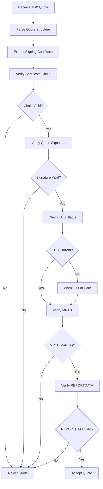
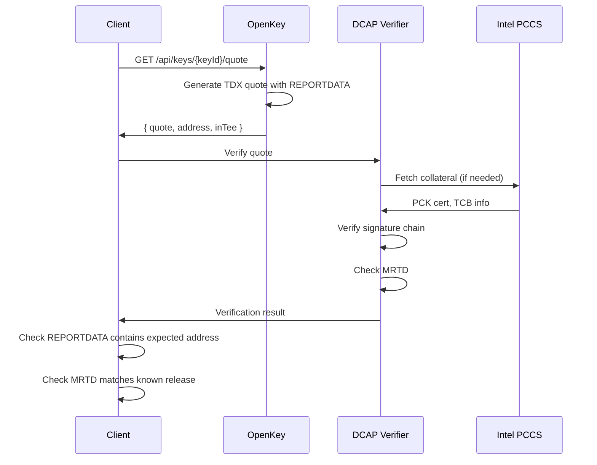

# Appendix C: Attestation Verification

This appendix describes TDX attestation structure, the DCAP verification process, and how clients verify that an OpenKey instance runs inside a genuine TEE.

## TDX Quote Structure

### What is a TDX Quote

A TDX quote is a signed attestation report generated by Intel TDX hardware. It cryptographically binds a measurement of the executing code to arbitrary user-provided data, signed by keys rooted in Intel's attestation PKI. Remote parties verify quotes to confirm:

1. The code runs inside a genuine Intel TDX Trust Domain
2. The code measurement matches expected values
3. User-provided data was generated by that specific code

### Quote Components

A TDX quote contains several fields:

| Field | Size | Description |
|-------|------|-------------|
| Header | 48 bytes | Version, attestation key type, TEE type |
| TD Report | 584 bytes | Measurements and attributes of the Trust Domain |
| Signature | Variable | ECDSA signature over header and report |

The TD Report includes:

| Field | Description |
|-------|-------------|
| MRTD | Measurement of the Trust Domain (code + initial state) |
| MRCONFIGID | Configuration ID set by the TD owner |
| MROWNER | Owner ID (typically zero for standard deployments) |
| RTMR[0-3] | Runtime measurements (extensible registers) |
| REPORTDATA | 64 bytes of user-provided data bound to the quote |

### MRTD: Code Measurement

MRTD (Measurement of Trust Domain) is a SHA-384 hash computed by the CPU during TD initialization. It captures:

- The TD's initial memory contents
- The TD's initial CPU state
- The firmware that launched the TD

Any change to the deployed code or configuration changes MRTD, allowing verifiers to detect unauthorized modifications.

### REPORTDATA: User-Bound Data

REPORTDATA provides 64 bytes for application-specific data bound to the attestation. OpenKey should bind quotes to a verifier-supplied fresh challenge rather than relying on timestamps alone:

```
REPORTDATA = SHA256(address || userId || verifierNonce || quoteContext)
```

| Component | Purpose |
|-----------|---------|
| address | Ethereum address being attested |
| userId | User who owns the key |
| verifierNonce | Fresh client-provided challenge for replay resistance |
| quoteContext | Additional context, such as purpose or timestamp |

This binding proves that a specific key belongs to a specific user for a specific verifier challenge. The current quote endpoint includes timestamped context; production client verification should require a nonce or equivalent fresh challenge to prevent replay and relay confusion.

### Quote Versions

TDX quotes exist in multiple versions:

| Version | Features |
|---------|----------|
| TDX 1.0 | Initial specification |
| TDX 1.5 | Added TD migration support, extended measurements |

Verifiers should parse the quote version and validate the fields required for that version.

## Intel DCAP Verification Flow

### DCAP Overview

DCAP (Data Center Attestation Primitives) provides the infrastructure for verifying TDX quotes without contacting Intel's attestation service for each verification. Instead, verifiers cache Intel-signed collateral and perform local verification.

### Verification Steps



### Step 1: Parse Quote Structure

Parse the binary quote into its components:
- Header (version, key type)
- TD Report (measurements, REPORTDATA)
- Signature (ECDSA over header + report)

Reject malformed quotes that do not match expected structure.

### Step 2: Verify Certificate Chain

The quote signature uses a key certified by Intel's attestation PKI:

```
Intel Root CA
    └── Intel PCK CA (Platform Certificate Key)
        └── PCK Certificate (Platform-specific)
            └── Quote Signing Key
```

Verification requires:
1. PCK certificate from the quote or fetched from cache
2. Intel PCK CA certificate (intermediate)
3. Intel Root CA certificate (trust anchor)

Each certificate must be valid (not expired, not revoked) and properly signed by its issuer.

### Step 3: Verify Quote Signature

Using the public key from the PCK certificate chain, verify the ECDSA signature over:

```
signature_input = header || td_report
```

Invalid signatures indicate tampering or forgery.

### Step 4: Check TCB Status

The Trusted Computing Base (TCB) status indicates whether the platform runs current firmware and microcode. Intel publishes TCB info signed by their root key:

| Status | Meaning |
|--------|---------|
| UpToDate | Platform runs latest TCB |
| OutOfDate | Updates available (security advisory) |
| Revoked | Platform has known vulnerability |
| ConfigurationNeeded | Platform requires configuration change |

OpenKey treats OutOfDate as a warning and Revoked as a failure.

### Step 5: Verify MRTD

Compare the quote's MRTD against known-good values:

```typescript
const expectedMrtd = getExpectedMrtd(quoteVersion);
if (quote.tdReport.mrtd !== expectedMrtd) {
  throw new Error('MRTD mismatch: unexpected code measurement');
}
```

Known-good MRTD values derive from OpenKey's published releases. Verifiers must obtain these values through a trusted channel (e.g., signed release artifacts).

### Step 6: Verify REPORTDATA

Check that REPORTDATA contains expected values:

```typescript
const expectedReportData = sha256(
  concat(keyAddress, userId, verifierNonce, quoteContext)
);
if (quote.tdReport.reportData !== expectedReportData) {
  throw new Error('REPORTDATA mismatch: quote bound to different data');
}
```

REPORTDATA verification confirms the quote corresponds to the specific key, user, verifier challenge, and request context claimed.

### Collateral Requirements

DCAP verification requires several pieces of Intel-signed collateral:

| Collateral | Source | Purpose |
|------------|--------|---------|
| PCK Certificate | Intel PCCS or cache | Signs quotes for this platform |
| PCK CA Certificate | Intel | Intermediate CA |
| Root CA Certificate | Intel | Trust anchor |
| TCB Info | Intel PCCS | Current TCB levels |
| QE Identity | Intel PCCS | Quoting Enclave identity |

PCCS (Provisioning Certificate Caching Service) runs either on-premises or uses Intel's hosted service. Collateral caches locally with periodic refresh.

## How Clients Verify an OpenKey Instance

### Attestation Endpoint

Clients request attestation through the quote endpoint:

```
GET /api/keys/{keyId}/quote
```

Response:

```json
{
  "quote": "BAACAAEAAAABAAAAAAEAAAAAAAABAAAAAAAAAP...",
  "address": "0x6a12D4e911703df11Fdf9F17e35DCe07E41dC04B",
  "inTee": true
}
```

| Field | Type | Description |
|-------|------|-------------|
| quote | string | Base64-encoded TDX quote |
| address | string | Ethereum address this quote attests |
| inTee | boolean | Whether the server runs in a TEE |

### Client Verification Flow



### Verification Steps for Clients

1. **Request quote**: Call the attestation endpoint for a specific key.

2. **Verify TDX quote signature**: Use an Intel DCAP library or third-party verification service.

3. **Verify REPORTDATA**: Parse the quote to extract REPORTDATA and confirm it contains:
   - The expected Ethereum address
   - A fresh verifier nonce or challenge
   - The expected user context
   - Any additional request context, such as timestamp or purpose

4. **Verify MRTD**: Compare against OpenKey's published code measurements.

5. **Optionally verify compose hash**: If using dstack-specific verification, check the compose hash in RTMR registers matches the published deployment configuration.

### Third-Party Verification Services

Several services provide TDX quote verification without running DCAP infrastructure:

- **Phala dcap-verifier**: Open-source verification service
- **Intel Trust Authority**: Intel's hosted attestation service
- **Azure Attestation**: Microsoft's attestation service (for Azure deployments)

These services verify the cryptographic properties of quotes and return structured results.

## Code Measurement and Compose Hash

### Reproducible Builds

For verifiers to check MRTD values, they must know what measurements correspond to legitimate OpenKey releases. Reproducible builds enable this:

1. Same source code + same build environment = same binary
2. Same binary + same deployment config = same MRTD
3. OpenKey publishes expected MRTD values alongside releases

### Compose Hash in dstack

dstack extends MRTD verification with compose hash checking. The compose hash captures the docker-compose.yaml contents, including:

- Container image references (with digests)
- Environment variable names (not values)
- Port mappings
- Volume mounts

dstack records the compose hash in RTMR[1], allowing verifiers to confirm the deployment configuration matches expectations.

### Published Verification Values

OpenKey releases include a verification manifest:

```json
{
  "version": "1.2.0",
  "mrtd": {
    "tdx1.0": "a1b2c3d4...",
    "tdx1.5": "e5f6g7h8..."
  },
  "composeHash": "sha256:9a8b7c6d...",
  "imageDigest": "sha256:1a2b3c4d...",
  "releaseDate": "2024-01-15T00:00:00Z",
  "signedBy": "did:pkh:eip155:1:0xOpenKeyRelease..."
}
```

Verifiers fetch this manifest through a trusted channel and compare against observed attestation values.

### Current Limitations

The reproducible build pipeline for OpenKey is not yet fully formalized. Current verification relies on:

- Trust in the deployment operator
- Comparison against operator-published values
- Community verification of builds

Future work includes:

- Automated reproducible build CI/CD
- Published MRTD values in a transparency log
- Multi-party build verification

## Attestation in Development Mode

### Development vs Production

OpenKey supports two operational modes:

| Mode | TEE_MODE | Attestation | Use Case |
|------|----------|-------------|----------|
| Development | `development` | Mock | Local development, testing |
| Production | `production` | Real TDX | Production deployments |

### Development Mode Behavior

When `TEE_MODE=development`:

```typescript
function isInTee(): boolean {
  return process.env.TEE_MODE === 'production';
}

async function getQuote(keyId: string): Promise<QuoteResponse> {
  if (!isInTee()) {
    return {
      quote: 'DEVELOPMENT_MODE_NO_QUOTE_AVAILABLE',
      address: key.address,
      inTee: false
    };
  }
  // Real TDX quote generation
}
```

The `inTee: false` flag signals to clients that attestation is unavailable. Clients must decide whether to trust development instances.

### Production Requirements

Production deployments require:

1. Running on TDX-capable hardware
2. `TEE_MODE=production` environment variable
3. dstack daemon available at `/var/run/dstack.sock`
4. Valid Intel attestation collateral accessible

Attempting to generate quotes in production mode without TEE hardware results in errors, not mock responses. This fail-closed behavior prevents accidental deployment without proper TEE protection.
