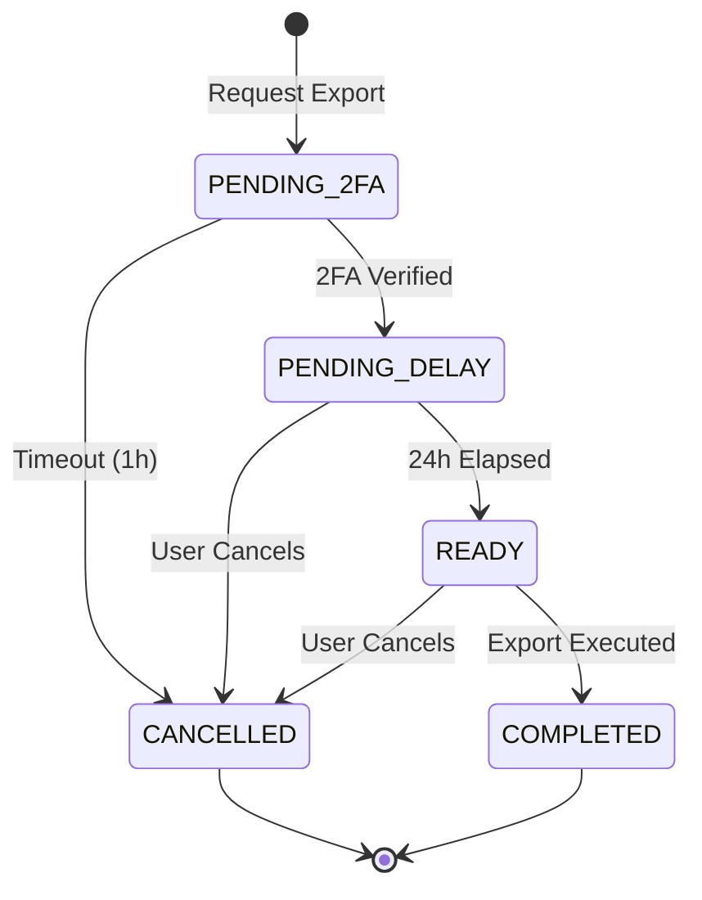

# Appendix D: Key Export Protocol

This appendix specifies the complete key export ceremony that allows users to extract private keys from TEE custody. The protocol deliberately introduces friction and delay to prevent unauthorized exports while preserving user sovereignty.

## Overview

### Purpose

The key export protocol enables users to take full custody of their Ethereum private keys, transferring them from OpenKey's TEE-protected environment to local storage. This capability ensures users retain ultimate control over their assets and are not locked into OpenKey's infrastructure.

### Design Philosophy

The export protocol embodies a deliberate tension:

- **User sovereignty**: Users must be able to access their own keys
- **Protection against compromise**: Unauthorized parties must not be able to export keys even with partial account access

To balance these concerns, the protocol:

1. Requires multiple authentication factors
2. Introduces a mandatory waiting period
3. Sends notifications at multiple stages
4. Allows cancellation at any time before completion
5. Uses end-to-end encryption for the exported key material

### Security Model

The export ceremony protects against:

| Threat | Mitigation |
|--------|------------|
| Session token theft | 2FA required (email + passkey) |
| Email account compromise | Passkey verification required |
| Passkey compromise | Email verification required |
| Both email and passkey compromised | 24-hour delay with notification |
| Network interception | HPKE encryption to client-generated key |

The 24-hour delay serves as the last line of defense. If a user notices unauthorized export activity during this window, they can cancel the export and secure their accounts.

## Protocol Steps

### State Machine



### Step 1: Export Request

**Endpoint**: `POST /api/keys/{keyId}/export/request`

**Authentication**: Valid session required

**Request Body**: None required

**Response**:
```json
{
  "exportId": "exp_abc123def456",
  "status": "PENDING_2FA",
  "expiresAt": "2024-01-16T12:00:00Z"
}
```

**Server Actions**:
1. Verify the requesting user owns the specified key
2. Verify no pending export exists for this key
3. Create export request record with status `PENDING_2FA`
4. Generate unique export ID
5. Send immediate email notification to user's registered email

**Email Content**:
```
Subject: Export Request for Your OpenKey

Someone (possibly you) requested to export a private key from your OpenKey account.

Key: 0x6a12...C04B (Primary Key)
Requested at: January 15, 2024 12:00 UTC
From IP: 203.0.113.42
Device: Chrome on macOS

If this was you, complete the verification process in the OpenKey app.

If this was NOT you, sign in immediately and cancel this request.
Then change your password and review your security settings.

This request expires in 1 hour if not verified.
```

### Step 2: 2FA Verification

Two-factor authentication requires both email confirmation and passkey verification, in either order.

#### Email Confirmation

**Endpoint**: `POST /api/keys/{keyId}/export/verify-email`

**Request Body**:
```json
{
  "exportId": "exp_abc123def456",
  "code": "847291"
}
```

The 6-digit code appears in a follow-up email or the user clicks a magic link that submits automatically.

#### Passkey Verification

**Endpoint**: `POST /api/keys/{keyId}/export/verify-passkey`

**Request Body**:
```json
{
  "exportId": "exp_abc123def456",
  "assertion": {
    "id": "credential_id_base64",
    "rawId": "credential_id_bytes_base64",
    "response": {
      "authenticatorData": "...",
      "clientDataJSON": "...",
      "signature": "..."
    },
    "type": "public-key"
  }
}
```

The client initiates WebAuthn authentication and submits the resulting assertion.

#### Completion

When both verifications complete:

**Response**:
```json
{
  "exportId": "exp_abc123def456",
  "status": "PENDING_DELAY",
  "delayExpiresAt": "2024-01-16T12:00:00Z"
}
```

**Server Actions**:
1. Transition status to `PENDING_DELAY`
2. Record verification timestamps
3. Set `delayExpiresAt` to current time + 24 hours
4. Send confirmation email

**Confirmation Email**:
```
Subject: Export Verification Complete - 24 Hour Waiting Period Started

Your export request has been verified. The 24-hour security waiting period has begun.

Key: 0x6a12...C04B (Primary Key)
Export available at: January 16, 2024 12:00 UTC

During this waiting period, you can cancel the export at any time from your OpenKey dashboard.

If you did not initiate this export, cancel it immediately and secure your accounts.
```

### Step 3: 24-Hour Delay

The mandatory waiting period serves as the primary defense against account compromise. During this window:

- The user receives periodic reminders
- The user can cancel at any time
- The export cannot proceed until the timer expires

**Reminder Email** (sent at T-4 hours):
```
Subject: Reminder: Key Export in 4 Hours

Your OpenKey export request will be ready in approximately 4 hours.

Key: 0x6a12...C04B (Primary Key)
Export available at: January 16, 2024 12:00 UTC

If you did not request this export, you still have time to cancel.
Cancel here: https://openkey.so/export/exp_abc123def456/cancel

After the export completes, the private key will exist outside OpenKey's
protection. Make sure you have a secure storage solution ready.
```

### Step 4: Cancellation (Optional)

Users can cancel pending exports at any time before execution.

**Endpoint**: `POST /api/keys/{keyId}/export/cancel`

**Request Body**:
```json
{
  "exportId": "exp_abc123def456"
}
```

**Response**:
```json
{
  "exportId": "exp_abc123def456",
  "status": "CANCELLED",
  "cancelledAt": "2024-01-15T18:30:00Z"
}
```

**Server Actions**:
1. Verify the requesting user owns the export request
2. Verify export is in `PENDING_2FA`, `PENDING_DELAY`, or `READY` status
3. Transition status to `CANCELLED`
4. Send cancellation confirmation email

**Notes**:
- Cancellation is permanent for this export request
- Users must start a new request to export after cancellation
- This prevents attackers from resuming a cancelled export

### Step 5: Export Execution

After the 24-hour delay expires, the user can execute the export.

**Endpoint**: `POST /api/keys/{keyId}/export/execute`

**Request Body**:
```json
{
  "exportId": "exp_abc123def456",
  "publicKey": "MCowBQYDK2VuAyEA..."
}
```

The `publicKey` field contains the client's ephemeral X25519 public key, base64-encoded.

**Response**:
```json
{
  "exportId": "exp_abc123def456",
  "status": "COMPLETED",
  "encryptedKey": "HPKE_CIPHERTEXT_BASE64..."
}
```

**Server Actions**:
1. Verify export status is `READY` (delay has expired)
2. Verify requesting user owns the export request
3. Derive sealing key using TEE
4. Unseal the private key
5. Encrypt the private key using HPKE to the client's public key
6. Clear the plaintext private key from memory
7. Transition status to `COMPLETED`
8. Return encrypted key material
9. Send completion notification email

**Completion Email**:
```
Subject: Key Export Completed

Your private key has been exported from OpenKey.

Key: 0x6a12...C04B (Primary Key)
Exported at: January 16, 2024 12:00 UTC

IMPORTANT: This key now exists outside OpenKey's TEE protection.
OpenKey cannot recover this key if you lose it, and cannot protect
it from compromise on your device.

The key remains usable within OpenKey until you choose to remove it.
```

### Step 6: Local Decryption

The client decrypts the exported key material locally:

```typescript
import * as hpke from '@noble/hpke';

async function decryptExportedKey(
  encryptedKey: string,
  ephemeralPrivateKey: Uint8Array
): Promise<string> {
  const suite = new hpke.Suite(
    hpke.Kem.DhkemX25519HkdfSha256,
    hpke.Kdf.HkdfSha256,
    hpke.Aead.Aes256Gcm
  );

  const ciphertext = base64ToBytes(encryptedKey);
  const info = new TextEncoder().encode('openkey-export-v1');

  const plaintext = await suite.open(
    { recipientKey: ephemeralPrivateKey },
    ciphertext,
    info
  );

  return new TextDecoder().decode(plaintext);
}
```

The result is the raw Ethereum private key in hexadecimal format (without `0x` prefix).

## HPKE Parameters

### Algorithm Selection

OpenKey uses HPKE (Hybrid Public Key Encryption, RFC 9180) for secure transport of exported keys. HPKE provides authenticated encryption with forward secrecy when using ephemeral keys.

### Cipher Suite

| Component | Selection | Identifier |
|-----------|-----------|------------|
| Mode | Base | 0x00 |
| KEM | DHKEM(X25519, HKDF-SHA256) | 0x0020 |
| KDF | HKDF-SHA256 | 0x0001 |
| AEAD | AES-256-GCM | 0x0002 |

### HPKE Encryption Process

**Server-side (in TEE)**:

```typescript
async function encryptForExport(
  privateKey: string,
  recipientPublicKey: Uint8Array
): Promise<string> {
  const suite = new hpke.Suite(
    hpke.Kem.DhkemX25519HkdfSha256,
    hpke.Kdf.HkdfSha256,
    hpke.Aead.Aes256Gcm
  );

  const info = new TextEncoder().encode('openkey-export-v1');
  const plaintext = new TextEncoder().encode(privateKey);

  const { ciphertext, encapsulatedKey } = await suite.seal(
    { recipientPublicKey },
    plaintext,
    info
  );

  // Return encapsulated key + ciphertext concatenated
  const result = new Uint8Array(encapsulatedKey.length + ciphertext.length);
  result.set(encapsulatedKey);
  result.set(ciphertext, encapsulatedKey.length);

  return bytesToBase64(result);
}
```

### Info Context

The info string `openkey-export-v1` provides domain separation, ensuring HPKE ciphertexts from OpenKey exports cannot be confused with HPKE ciphertexts from other applications.

### Forward Secrecy

Because clients generate ephemeral X25519 key pairs for each export:

1. Compromise of the client's long-term keys does not reveal previously exported keys
2. Each export uses a unique encryption key derived from fresh randomness
3. The ephemeral private key exists only in client memory during decryption

## Security Considerations

### Defense in Depth

The export ceremony layers multiple protections:

| Layer | Protection Against |
|-------|-------------------|
| Session authentication | Anonymous attackers |
| Email verification | Session theft without email access |
| Passkey verification | Session theft without device access |
| 24-hour delay | Full account compromise (detection window) |
| HPKE encryption | Network interception, server-side logging |

### Email Notification Limitations

Email notifications represent a weak link if the attacker compromises the user's email account. However, email compromise alone is insufficient:

- Without the passkey, email verification passes but passkey verification fails
- The 24-hour delay still provides a detection window through other means (dashboard, mobile notifications if configured)

### Post-Export Security

After successful export:

1. The private key exists outside the TEE
2. OpenKey's security guarantees no longer apply to that key
3. The user bears full responsibility for secure storage
4. The key remains functional within OpenKey (no automatic deletion)

Users should:
- Store exported keys in hardware wallets or secure offline storage
- Consider removing the key from OpenKey if no longer needed there
- Understand that exported keys cannot return to TEE-only custody

### Rate Limiting

To prevent abuse:

- Maximum 1 pending export per key at any time
- Failed 2FA attempts rate-limited (5 attempts per hour)
- New export requests require previous to complete or be cancelled
- Repeated cancellation/re-request patterns trigger additional verification

### Audit Trail

All export-related events persist in an audit log:

| Event | Logged Data |
|-------|-------------|
| Export requested | Timestamp, IP, user agent, key ID |
| Email sent | Timestamp, email type |
| 2FA verified | Timestamp, method (email/passkey) |
| Delay started | Timestamp, expiry time |
| Cancelled | Timestamp, reason if provided |
| Executed | Timestamp, completion status |

Users can review their export history through the dashboard.

## Implementation Status

This protocol specification describes the intended design for OpenKey's key export functionality. The current OpenKey codebase does not yet implement the export feature. When implemented, the actual API endpoints and response formats may differ from this specification while maintaining the security properties described.

Key implementation considerations for future development:

1. **Email service integration**: Reliable email delivery with proper SPF/DKIM configuration
2. **Timer accuracy**: Server-side enforcement of the 24-hour delay without clock drift vulnerabilities
3. **Memory handling**: Secure clearing of plaintext keys after HPKE encryption
4. **Database transactions**: Atomic status transitions to prevent race conditions
5. **Client SDK**: Reference implementation for HPKE decryption and key handling
